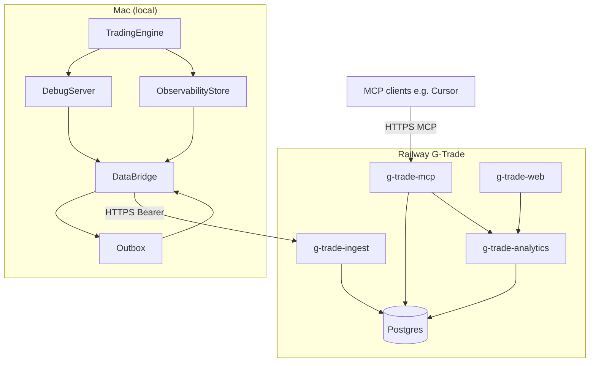

# TUI Sunset and Railway Data Network — Architecture and Execution Plan

## 1. What We Are Changing (Total Drift)

**Before:** Operator uses a Textual TUI as the primary interface. TUI runs in a separate process, calls the local debug server and MCP over HTTP, and displays overview, execution, decisions, events, runs, and controls. The trading engine runs in the same process as `es-trade start`; it updates in-memory state and writes to a local SQLite observability store. No cloud. Execution, market data, and order flow are entirely on the Mac.

**After:** TUI is removed. CLI is the only local operator interface: `es-trade start|stop|restart|debug|events|config|balance|status` (and replay). The same process runs the engine and debug server (health + debug HTTP only; **MCP moves to Railway**). New: an in-process **data bridge** thread that periodically reads debug state and observability, writes payloads to a **local outbox** (durable queue), and sends batches to a **Railway ingest API** over HTTPS with bearer auth. Railway runs **Postgres**, **ingest API**, **analytics API**, **MCP server**, and **Next.js app**. Cursor and other MCP clients connect to the Railway MCP endpoint; they no longer require the local process to be running. All cloud components are analytics and tooling only; no execution, no Topstep API, no order flow. Single-user auth on every exposed surface.

**Invariants:** (1) Topstep API and execution stay on the Mac. (2) Data flows one way: Mac → Railway. (3) Cloud never sends orders or market data back. (4) Local trading is unaffected by Railway being down (bridge fails open, outbox retries later).

---

## 2. Feature Placement: What Stays Local vs What Runs on Railway

A single, explicit split so we know where each capability lives and why.

### 2.1 Staying local (Mac only)

| Feature / capability                   | Reason                                                                                                                                                             |
| -------------------------------------- | ------------------------------------------------------------------------------------------------------------------------------------------------------------------ |
| **Topstep API and execution**          | Compliance and ToS: no execution from cloud, no VPN/VPS for the trading account. Orders, positions, market stream, user hub, and any broker calls stay on the Mac. |
| **Trading engine and strategy**        | Core of the trading process; depends on live market and execution. Runs in the same process as `es-trade start`.                                                   |
| **Order executor and reconciliation**  | Directly drives broker; must stay with Topstep client.                                                                                                             |
| **Debug server (health + debug HTTP)** | Serves local CLI and scripts: health check, `get_state().to_dict()`, runtime manifest. Used by `es-trade status`, `debug`, and the data bridge. No MCP here.       |
| **Observability store (SQLite)**       | Local event/run/trade store; source of truth for the bridge. Stays so the engine and bridge are not dependent on cloud availability.                               |
| **CLI**                                | Only operator surface on the Mac: start, stop, restart, debug, events, config, balance, status, replay.                                                            |
| **Data bridge and outbox**             | Runs in-process; reads from debug server and observability, writes to local outbox, drains to Railway ingest. Must stay local to push data from Mac to cloud.      |
| **Runtime files and config**           | PID, status, lifecycle/operator requests, YAML + env. All execution and local tooling config stays on the Mac.                                                     |

### 2.2 On Railway (cloud)

| Feature / capability | Reason                                                                                                                                                                                                                                                                                                                                               |
| -------------------- | ---------------------------------------------------------------------------------------------------------------------------------------------------------------------------------------------------------------------------------------------------------------------------------------------------------------------------------------------------- |
| **Postgres**         | Durable analytics store for runs, events, state snapshots, trades. Single source of truth in the cloud.                                                                                                                                                                                                                                              |
| **Ingest API**       | Receives state/events/trades from the Mac bridge; writes to Postgres. Decouples bridge from DB and enforces auth.                                                                                                                                                                                                                                    |
| **Analytics API**    | Read-only API over Postgres for dashboards, tools, and the web app.                                                                                                                                                                                                                                                                                  |
| **MCP server**       | Cursor and other MCP clients connect here instead of to the local process. Serves tools (e.g. query_events, list_runs, get_performance_summary, get_runtime_summary) and resources from Postgres/analytics so the IDE can inspect runs and state even when the Mac process is stopped. Same protocol and tool names as today; backend is cloud data. |
| **Next.js web app**  | Internal analytics UI; calls analytics API only. Replaces TUI for viewing runs, events, and tooling.                                                                                                                                                                                                                                                 |

Summary: **Execution and everything that touches the broker stay local.** **Storage, analytics, MCP, and the web UI live on Railway** so tooling and dashboards work regardless of whether the trading process is running.

---

## 3. All Moving Components

### 3.1 Local (Mac) — existing and new

| Component              | Role                                                                                            | Change                                                                                             |
| ---------------------- | ----------------------------------------------------------------------------------------------- | -------------------------------------------------------------------------------------------------- |
| **Process**            | Single process for `es-trade start`: engine, debug server, bridge.                              | Unchanged; bridge added; MCP removed from this process.                                            |
| **TradingEngine**      | Strategy, sync, protection, adoption, dynamic exit.                                             | Unchanged.                                                                                         |
| **OrderExecutor**      | Orders, protection, reconciliation.                                                             | Unchanged.                                                                                         |
| **TopstepClient**      | Auth, market stream, user hub, orders, positions.                                               | Unchanged.                                                                                         |
| **DebugServer**        | Health + debug HTTP only; serves `get_state().to_dict()`. MCP no longer mounted here.           | Remove MCP route; keep health and debug for CLI and bridge.                                        |
| **ObservabilityStore** | SQLite: events, runs, completed trades.                                                         | Unchanged.                                                                                         |
| **Config**             | YAML + env; logging, server ports, alpha, risk, etc.                                            | Add: `observability.railway_ingest_url`, `railway_ingest_api_key` (or env), outbox/retry settings. |
| **Runtime files**      | `runtime/trader.pid`, `runtime_status.json`, `lifecycle_request.json`, `operator_request.json`. | Unchanged.                                                                                         |
| **CLI**                | Commands: start, stop, restart, debug, events, config, balance, replay.                         | Remove TUI command and `run_tui`; no-arg → `cli(['--help'])`; add `status` command.                |
| **TUI package**        | `src/tui/` (app, read_models, **init**).                                                        | **Deleted.**                                                                                       |
| **Data bridge**        | Thread started after debug server in `start` flow.                                              | **New.** Reads state + observability, writes to outbox, drains outbox to Railway ingest.           |
| **Outbox**             | Persistent queue (e.g. SQLite table or file-based) for state/event batches.                     | **New.** Ensures at-least-once delivery and crash recovery.                                        |

### 3.2 Railway (G-Trade project) — deployed artifacts

| Component            | Type                     | Role                                                                 |
| -------------------- | ------------------------ | -------------------------------------------------------------------- |
| **Postgres**         | Railway managed database | Single analytics database for all services.                          |
| **g-trade-ingest**   | Python FastAPI service   | Accepts state/events/trades from bridge; writes to Postgres.         |
| **g-trade-analytics**| Python FastAPI service   | Read-only API over Postgres for dashboards and tools.                |
| **g-trade-mcp**      | MCP server (e.g. Python) | MCP endpoint for Cursor/IDE; tools and resources backed by Postgres. |
| **g-trade-web**      | Next.js app              | Internal UI that calls analytics API only.                           |

---

## 4. Railway Service Catalog (Purpose, Why, What, How, Why That Way)

### 4.1 Postgres (Railway managed database)

- **Purpose:** Single source of truth in the cloud for runs, events, state snapshots, completed trades, and (if enabled) raw market data. All other Railway services read or write this store only; no broker or execution state.
- **Why we're deploying it:** We need a durable, queryable store for analytics. SQL is the right fit for runs, events, and trades; Postgres is supported by Railway and fits the rest of the stack.
- **What it is:** A Postgres 15+ instance provisioned via `railway add --database postgres` in project G-Trade. One database per environment (e.g. production). Connection string is exposed as `DATABASE_URL` and referenced by ingest and analytics services.
- **How it's done:** Create with Railway CLI; attach `DATABASE_URL` to ingest and analytics via variable references (e.g. `${{Postgres.DATABASE_URL}}`). Schema is applied by the ingest service on startup (or via a one-off migration step). Tables: `runs`, `events`, `state_snapshots`, `completed_trades`; optional `raw_quotes` (or similar) if raw feed is sent, with retention policy.
- **Why that way:** Managed Postgres avoids self-hosted DB ops. Single DB keeps consistency and backup simple. Schema owned by our code keeps deployments reproducible.

---

### 4.2 g-trade-ingest (Python FastAPI service)

- **Purpose:** Receive telemetry from the Mac: state snapshots and event/trade batches. Authenticate the sender, validate payloads, and write to Postgres. No execution logic, no Topstep, no market data ingestion from any broker.
- **Why we're deploying it:** The local bridge must have a single, well-defined HTTPS endpoint to POST to. Ingest decouples the bridge from the database and enforces auth and idempotency at the edge.
- **What it is:** A Python 3.11+ FastAPI app. Endpoints: `POST /ingest/state` (body: debug state snapshot), `POST /ingest/events` (body: list of events), `POST /ingest/trades` (body: list of completed trades). Each request must include `Authorization: Bearer <INGEST_API_KEY>`. Writes go to Postgres; responses are 200/4xx/5xx with no side effects to the trading system.
- **How it's done:** Code lives in this repo under a dedicated directory (e.g. `railway/ingest/` or `es-hotzone-trader/railway/ingest/`). Dockerfile or Nixpacks build; deploy via `railway up` or GitHub integration. Environment variables: `DATABASE_URL` (from Postgres), `INGEST_API_KEY` (shared secret with Mac). Idempotency: use `batch_id` or `(run_id, captured_at)` to deduplicate; reject or ignore duplicates.
- **Why that way:** FastAPI is Python (same language as the rest of the stack), has clear request/response semantics, and is easy to secure and test. Single service keeps the write path simple and auditable.

---

### 4.3 g-trade-analytics (Python FastAPI service)

- **Purpose:** Expose read-only APIs over Postgres for the Next.js app and any future tools: run list, run detail, event queries, trade history, PnL attribution, exposure over time, execution quality, sizing diagnostics. No writes to execution state; no connection to Topstep or any broker.
- **Why we're deploying it:** Analytics and dashboards need a stable API that the frontend can call. Separating read from write (ingest) keeps the write path simple and allows different scaling and caching for reads.
- **What it is:** A Python 3.11+ FastAPI app. Endpoints are read-only (GET or POST query-style). Examples: `GET /runs`, `GET /runs/{run_id}`, `GET /runs/{run_id}/events`, `GET /runs/{run_id}/trades`, `GET /analytics/summary`, `GET /analytics/attribution`, etc. All data comes from Postgres. Auth: require a valid session or API token (single-user allowlist).
- **How it's done:** Code in same repo under e.g. `railway/analytics/`. Connects to same Postgres via `DATABASE_URL`. Uses private networking where possible (e.g. `postgres.railway.internal`). Deploy as a second Railway service in G-Trade. Auth implemented with a shared secret or JWT for the single operator.
- **Why that way:** Python again for consistency and reuse of data models. Read-only service can be optimized (indexes, optional read replica later) without touching the ingest path. Single tenant so we don’t need a full IAM layer.

---

### 4.4 g-trade-mcp (MCP server on Railway)

- **Purpose:** Expose the same MCP protocol and tool set (e.g. query_events, list_runs, get_performance_summary, get_runtime_summary, current run resource) so Cursor and other MCP clients can inspect runs, events, and state from the cloud. No execution; read-only over data already in Postgres.
- **Why we're deploying it:** MCP belongs on Railway so the IDE can use it without the local trading process running. Operators get a single, always-available MCP endpoint backed by ingested data instead of a local-only server tied to `es-trade start`.
- **What it is:** An MCP server (e.g. Python, same protocol as today) that implements the same tool names and resource URIs. It reads from Postgres or from the analytics API (or both). Auth: same single-operator model (e.g. bearer or session); Cursor config points at the Railway MCP URL.
- **How it's done:** Code in same repo under e.g. `railway/mcp/` or alongside the analytics service. Reuse MCP message handling and tool/resource contracts from `src/server/mcp_server.py`; swap the backend from `StateGetter` to analytics API or direct Postgres queries. Deploy as a Railway service with a public HTTPS URL (or private + auth). Env: `DATABASE_URL` or `ANALYTICS_API_URL`, plus auth secret. Cursor's MCP config uses this URL instead of `http://127.0.0.1:<port>/mcp`.
- **Why that way:** One MCP endpoint in the cloud keeps Cursor usage simple and independent of the Mac process. Reusing the existing tool/resource schema avoids breaking IDE workflows; only the data source changes from live in-memory state to Postgres.

---

### 4.5 g-trade-web (Next.js app)

- **Purpose:** Internal UI for the single operator to view analytics, run lists, event/trade history, and any tooling we build on top of the analytics API. No execution controls that send orders; optional read-only “view state” from latest snapshot.
- **Why we're deploying it:** Replace the TUI with a proper web-based analytics and tooling surface that can evolve (charts, filters, exports) without shipping a new desktop app.
- **What it is:** A Next.js (React) app. Calls only the analytics API (and optionally a “latest state” endpoint). All pages behind auth; single-user allowlist. No direct Postgres or ingest access. Deployed as a third Railway service with a public HTTPS domain (or a private URL if we add auth at the edge).
- **How it's done:** Code in same repo under e.g. `railway/web/` or a dedicated `g-trade-web` directory. Build with Node; deploy via Railway. Env: `NEXT_PUBLIC_ANALYTICS_API_URL` (or server-side only) pointing at the analytics service. Auth: simple allowlist (e.g. one email or API key) or OAuth with a single allowed account; no public signup.
- **Why that way:** Next.js/React is a standard choice for internal dashboards and keeps the door open for richer UX later. We deploy it only after ingest and analytics are stable so the frontend has a fixed contract to consume.

---

## 5. Single-Path Decisions (No Optional Branches)

- **No-arg `main()`:** When the user runs `es-trade` with no arguments, we invoke `cli(['--help'])` so they see all commands. We also add a `status` command that prints a one-screen summary (running/stopped, position, daily PnL, health URL) by reading `_fetch_remote_debug_state` or `runtime_status.json`.
- **Bridge placement:** The data bridge runs **in-process** as a thread started from the same process that runs the engine (in `commands.py` after the debug server starts). We do not use a separate sidecar process as the primary path; one process keeps deployment and lifecycle simple.
- **Bridge durability:** The bridge writes every batch to a **local outbox** (SQLite table or file-based queue) before attempting HTTP. A separate drain loop (or same thread with backoff) sends from the outbox to Railway with exponential backoff and idempotency keys. On restart, we drain the outbox before or in parallel with normal operation. Trading logic never blocks on bridge or network.
- **Ingest stack:** Python FastAPI only. No Node or other runtimes for ingest.
- **Analytics stack:** Python FastAPI only. Read-only.
- **Web stack:** Next.js (React). Introduced only after ingest and analytics are deployed and stable.
- **Database:** One Postgres per environment. No Redis or other stores for the first version unless we later add caching in front of the analytics API.
- **Auth:** Ingest: Bearer token (`INGEST_API_KEY`). Analytics, MCP, and Web: single-operator auth (allowlist or one API key / one OAuth account). No public unauthenticated endpoints.
- **MCP placement:** MCP runs on Railway only. The local debug server no longer mounts an MCP route. Cursor and other clients point at the Railway MCP service URL.

---

## 6. Constraint and Compliance (Unchanged)

- **Topstep:** Execution, Topstep API calls, and live market/order streams remain on the Mac only. No VPN/VPS for the trading account; no execution from Railway ([Topstep Terms](https://www.topstep.com/terms-of-use/)).
- **CME/data:** Raw market data may be sent to cloud for personal use only; private scope, no redistribution, retention and access controls as in the plan. Compliance and licensing remain the operator’s responsibility ([CME licensing](https://www.cmegroup.com/market-data/license-data.html)).
- **Research traceability:** Material architecture or strategy changes include citations and assumption notes in docs or PRs.

---

## 7. Phased Execution Order

1. **Phase 0 — Freeze and compliance:** Stop the trader (`es-trade stop`), ensure no stuck unresolved entry, document Topstep/CME boundaries, and confirm the operator is ready for migration. No code deployment yet.
2. **Phase 1 — TUI sunset and CLI primary:** Delete `src/tui/`, remove TUI from CLI and `main()`, add `status` command, remove Textual from deps, update docs. Smoke-test start/stop/debug/events/status. No Railway.
3. **Phase 2 — Local bridge and outbox:** Implement the in-process bridge and outbox (config-gated), with a mock or stub ingest URL. Validate batching, retry, and idempotency locally. Trading remains fully functional if bridge is off or failing.
4. **Phase 3 — Railway Postgres and ingest:** In G-Trade project, add Postgres and deploy g-trade-ingest; run schema migrations; set `INGEST_API_KEY` and `DATABASE_URL`. Point the Mac bridge at the live ingest URL and verify state/events/trades in Postgres.
5. **Phase 4 — Railway analytics API:** Deploy g-trade-analytics with read-only endpoints; connect it to the same Postgres; add single-operator auth. Verify from curl or a small script.
6. **Phase 5 — Railway Next.js app:** Deploy g-trade-web; configure it to call the analytics API and enforce auth. Keep UI minimal at first; iterate after backend is stable.
7. **Phase 6 — Railway MCP:** Deploy g-trade-mcp; implement same tools/resources backed by Postgres or analytics API; add auth. Remove MCP from local debug server; document Railway MCP URL for Cursor config.
8. **Phase 7 — Hardening:** Backpressure on outbox size, alerts on queue growth, replay/consistency checks, and a short runbook for recovery and rollback.

---

## 8. Data Flow (Final)

---

## 9. Summary of Code and Config Changes

| Area                            | Action                                                                                                    |
| ------------------------------- | --------------------------------------------------------------------------------------------------------- |
| `src/tui/`                      | Delete entire package.                                                                                    |
| `src/cli/commands.py`           | Remove TUI import and `tui` command; no-arg `main()` → `cli(['--help'])`; keep existing `status` command. |
| `src/cli/runtime_controller.py` | Default `source` in `write_operator_request` → `"cli"`.                                                   |
| `src/server/debug_server.py`    | Remove MCP route; keep health and debug HTTP only.                                                        |
| `pyproject.toml`                | Remove `textual` dependency.                                                                              |
| New: bridge + outbox            | In-process thread; durable outbox (SQLite or file); config-gated; bearer auth.                            |
| Config                          | `observability.railway_ingest_url`, `RAILWAY_INGEST_API_KEY` (or env), outbox/retry/fail-open settings.   |
| Railway                         | Postgres; g-trade-ingest; g-trade-analytics; g-trade-mcp; g-trade-web (Next.js).      |
| Cursor / MCP                    | Point MCP config at Railway MCP URL; remove local MCP dependency.                                         |
| Docs                            | OPERATOR.md (CLI as primary); compliance boundary doc (Topstep/CME); Railway MCP URL and auth.            |

No Topstep execution or API moves to Railway. The executor remains entirely on the Mac with a single, one-way data path to the cloud for analytics and storage.

---

## 10. Codebase review and plan gaps (last-pass checklist)

This section is a direct audit of the repo against the plan so no small, high-impact detail is missed.

### 10.1 TUI removal — verified touchpoints

| Location                                                                       | Current state                                                                                                       | Plan action                                                  |
| ------------------------------------------------------------------------------ | ------------------------------------------------------------------------------------------------------------------- | ------------------------------------------------------------ |
| [es-hotzone-trader/src/tui/](es-hotzone-trader/src/tui/)                       | `app.py`, `read_models.py`, `__init__.py`; Textual app, `run_tui()`, `mcp_tool_call()` and TUI-specific read models | Delete entire package.                                       |
| [es-hotzone-trader/src/cli/commands.py](es-hotzone-trader/src/cli/commands.py) | `from src.tui import run_tui`; `tui()` command; `main()` when `not args` → `run_tui()`                              | Remove import and `tui` command; no-arg → `cli(['--help'])`. |
| [es-hotzone-trader/pyproject.toml](es-hotzone-trader/pyproject.toml)           | `textual>=0.80.0` in dependencies; `es-trade = "src.cli.commands:main"`                                             | Remove `textual`; entrypoint stays.                          |
| [es-hotzone-trader/src/cli/**main**.py](es-hotzone-trader/src/cli/__main__.py) | Calls `main()` (no args from CLI)                                                                                   | No change; behavior follows `main()`.                        |

**Easy to miss:** The only other references to `run_tui` or `src.tui` are in the TUI package itself and in `commands.py`. No other modules import the TUI. Deleting `src/tui/` and the two `commands.py` changes is sufficient for TUI removal.

### 10.2 Default "source" and operator request payloads

| Location                                                                                           | Current state                                                                                | Plan action                                                        |
| -------------------------------------------------------------------------------------------------- | -------------------------------------------------------------------------------------------- | ------------------------------------------------------------------ |
| [es-hotzone-trader/src/cli/runtime_controller.py](es-hotzone-trader/src/cli/runtime_controller.py) | `write_operator_request(..., source: str = "tui")`                                           | Change default to `"cli"`.                                         |
| [es-hotzone-trader/src/engine/trading_engine.py](es-hotzone-trader/src/engine/trading_engine.py)   | `data.get("source", "tui")` in operator_request handling (force_reconcile, clear_unresolved) | Change default to `"cli"` so event payloads reflect CLI as source. |

**Easy to miss:** The engine’s default source is in two places (lines ~683 and ~694). Both should be updated so analytics and logs are consistent after TUI removal.

### 10.3 Local MCP removal — verified touchpoints

| Location                                                                                               | Current state                                                                                                                                                                                                                                                            | Plan action                                                                                                                                                                                            |
| ------------------------------------------------------------------------------------------------------ | ------------------------------------------------------------------------------------------------------------------------------------------------------------------------------------------------------------------------------------------------------------------------ | ------------------------------------------------------------------------------------------------------------------------------------------------------------------------------------------------------ |
| [es-hotzone-trader/src/server/debug_server.py](es-hotzone-trader/src/server/debug_server.py)           | `DebugHandler.do_GET`: serves `/debug`, `/`, and `config.mcp_path` (MCP metadata). `do_POST`: only handles `config.mcp_path` (MCP JSON-RPC). `DebugServer.start()` logs "MCP endpoint started...".                                                                       | Remove MCP branch from `do_GET` (no response for mcp_path). Remove entire `do_POST` MCP handling (return 404 for POST to debug server). Remove or conditionalize the "MCP endpoint started" log.       |
| [es-hotzone-trader/src/server/debug_server.py](es-hotzone-trader/src/server/debug_server.py)           | `TradingState.mcp_url`; set from manifest in `commands.py`                                                                                                                                                                                                               | Either stop setting `mcp_url` from a local URL, or set it from an optional config `railway_mcp_url` so manifest/docs can show where to point Cursor.                                                   |
| [es-hotzone-trader/src/cli/commands.py](es-hotzone-trader/src/cli/commands.py)                         | `_log_startup_summary`: logs `mcp_url` (local). `_runtime_urls`: returns `mcp_url` (local). `_startup_payload`: includes `mcp_path`. `collect_run_provenance(..., mcp_url=urls["mcp_url"])`. Start command prints "MCP server: [http://127.0.0.1](http://127.0.0.1):..." | Switch to optional `railway_mcp_url` from config for manifest and startup print; if unset, manifest `mcp_url` can be `None` and startup can print "MCP (Railway): configure in docs" or omit the line. |
| [es-hotzone-trader/src/observability/provenance.py](es-hotzone-trader/src/observability/provenance.py) | `collect_run_provenance(..., mcp_url=...)`; included in manifest dict                                                                                                                                                                                                    | Keep signature; caller passes Railway MCP URL from config or None.                                                                                                                                     |
| [es-hotzone-trader/config/default.yaml](es-hotzone-trader/config/default.yaml)                         | `server.mcp_enabled: true`, `server.mcp_path: "/mcp"`                                                                                                                                                                                                                    | Either keep for backward compat (ignored once MCP is removed from debug server) or add `server.railway_mcp_url` (optional) and document; deprecate or repurpose `mcp_enabled`.                         |
| [es-hotzone-trader/src/config/loader.py](es-hotzone-trader/src/config/loader.py)                       | `ServerConfig`: `mcp_enabled`, `mcp_path`                                                                                                                                                                                                                                | Add optional `railway_mcp_url: Optional[str] = None` if we want manifest/startup to show Railway MCP URL.                                                                                              |
| [.cursor/mcp.json](.cursor/mcp.json)                                                                   | `g_trade` points at `http://127.0.0.1:8081/mcp`                                                                                                                                                                                                                          | Document in plan/docs: operator updates this to Railway MCP URL after deploy. Do not hardcode production URL in repo if it’s env-specific.                                                             |

**Easy to miss:** `do_POST` on the debug server currently only serves MCP. After removing MCP, POST to the debug server should return 404 (or we could leave POST unimplemented). The startup banner line "MCP server: http://..." must be updated or removed so we don’t advertise a local MCP that no longer exists.

### 10.4 Bridge and observability — data sources for the bridge

The bridge will read:

- **State:** HTTP GET to local debug server `/debug` (or `get_state().to_dict()` in-process) for state snapshots.
- **Events / runs / trades:** From [es-hotzone-trader/src/observability/store.py](es-hotzone-trader/src/observability/store.py): `query_events()`, `query_run_manifests()`, `get_run_manifest()`, `query_completed_trades()`. Schema: `events`, `run_manifests`, `completed_trades` tables.

**Plan already covers:** Config for `observability.railway_ingest_url` and ingest API key. Add to [ObservabilityConfig](es-hotzone-trader/src/config/loader.py) (and default.yaml): e.g. `railway_ingest_url: ""`, `railway_ingest_api_key` from env; optional outbox path and retry settings. Bridge is gated on non-empty ingest URL.

### 10.5 Tests

| Location                                                                                       | Dependency                                                                                                                                                            | Plan action                                                                                                                      |
| ---------------------------------------------------------------------------------------------- | --------------------------------------------------------------------------------------------------------------------------------------------------------------------- | -------------------------------------------------------------------------------------------------------------------------------- |
| [es-hotzone-trader/tests/test_matrix_engine.py](es-hotzone-trader/tests/test_matrix_engine.py) | Imports `handle_mcp_request`, `handle_mcp_http_request`, `reset_mcp_sessions` from `src.server.mcp_server`; tests MCP tools and resources with in-memory state/getter | Keep. These test the MCP handler logic that will be reused by g-trade-mcp (same module, different backend). No TUI imports. |
| TUI or `run_tui`                                                                               | No tests import `run_tui` or EsTradeTui                                                                                                                               | No test changes required for TUI deletion.                                                                                       |

**Easy to miss:** After removing the MCP route from the debug server, any test that starts the real debug server and hits the MCP path will get 404. If such tests exist (outside test_matrix_engine’s direct handler tests), they need to be updated or removed.

### 10.6 Docs and runbooks

| Location                                                                                           | Current state                                                   | Plan action                                                                                          |
| -------------------------------------------------------------------------------------------------- | --------------------------------------------------------------- | ---------------------------------------------------------------------------------------------------- |
| [docs/ES Hot Zone Trader Live Restart Runbook.md](docs/ES Hot Zone Trader Live Restart Runbook.md) | References ports 8080/8081, `curl .../health`, `curl .../debug` | Keep health/debug; add note that MCP is on Railway and Cursor should use Railway MCP URL (see docs). |
| [docs/Current_Plan.md](docs/Current_Plan.md)                                                       | Mentions auditing MCP session and runbook for MCP               | Update to align with TUI sunset plan: MCP on Railway, no local MCP.                                  |
| OPERATOR.md                                                                                        | Plan mentions creating/updating OPERATOR.md (CLI as primary)    | Create or update to describe CLI-only workflow and where to configure Railway MCP in Cursor.         |

### 10.7 Status command

The plan previously said "add status command." The codebase already has a `status` command ([commands.py](es-hotzone-trader/src/cli/commands.py) ~1045) that uses `_fetch_remote_debug_state(cfg)` or `get_state()` and prints status, running, data_mode, zone, strategy, position, PnL, risk state. No change needed except to ensure no-arg `main()` shows help (so users see `status` in the command list).

### 10.8 Summary of easy-to-miss items

1. **Engine default source:** Change `data.get("source", "tui")` to `"cli"` in `trading_engine.py` (both operator_request branches).
2. **Debug server POST:** After removing MCP, decide and document that POST to debug server returns 404 (or equivalent).
3. **Startup banner:** Stop printing local "MCP server: [http://127.0.0.1:8081/mcp](http://127.0.0.1:8081/mcp)"; use optional `railway_mcp_url` from config or omit.
4. **Config:** Add `ObservabilityConfig.railway_ingest_url` (and related); add optional `ServerConfig.railway_mcp_url` for manifest and Cursor docs.
5. **Manifest/provenance:** Continue passing `mcp_url` into `collect_run_provenance`; value is Railway MCP URL from config or None.
6. **.cursor/mcp.json:** Document that operator must point `g_trade` at Railway MCP URL after deployment; do not rely on localhost after go-live.
7. **Tests:** Confirm no test starts the live debug server and asserts on MCP route; if any do, update or remove.

This checklist should be used during implementation so the refactor is complete and consistent with the architecture.