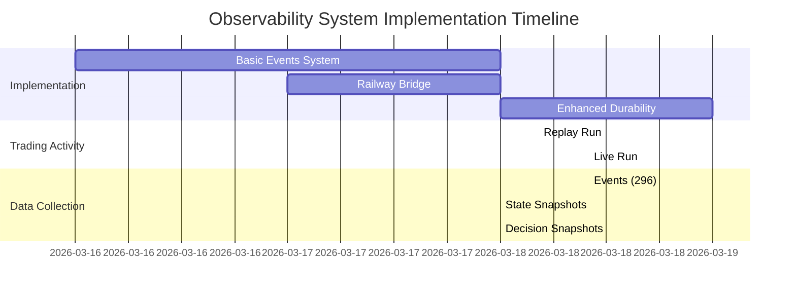

# March 18th Data Recovery Analysis

**Date**: 2026-03-18
**Status**: Partial Recovery Possible
**Recovery Rate**: ~13.4% (296 of ~2,200 expected events)

## Executive Summary

We **CAN partially recover** March 18th trading data from the local SQLite durability layer, but the recovery is **incomplete** due to timing: the comprehensive observability system was implemented **during** the trading session on March 18th. 

**Recoverable Data:**
- ✅ **296 events** (system, market, decision, risk events)
- ✅ **2 run manifests** (replay and live sessions)
- ✅ **0 completed trades** (correct - no trades occurred)

**Lost Data:**
- ❌ **State snapshots** (0 records - feature not yet implemented during run)
- ❌ **Decision snapshots** (0 records - feature not yet implemented during run)
- ❌ **Market tape** (0 records - feature not yet implemented during run)
- ❌ **Order lifecycle** (0 records - feature not yet implemented during run)
- ❌ **Bridge health** (0 records - feature not yet implemented during run)

## Data Availability Timeline



## Root Cause: Feature Implementation Timing

### Git Commit History

```bash
$ git log --pretty=format:"%h %ad %s" --date=short -- src/observability/

a776541 2026-03-18 feat: preserve observability data end-to-end
905362a 2026-03-17 Bridge, config, and tests for Railway ingest
2247b1e 2026-03-16 Add embedded MCP observability and provenance
```

### Implementation Details

**March 16, 2026 (commit 2247b1e)**
- ✅ Basic events table created
- ✅ Run manifests table created
- ✅ Event recording infrastructure
- ❌ No state/decision/market tape tables yet

**March 17, 2026 (commit 905362a)**
- ✅ Railway bridge implementation
- ✅ Outbox durability layer
- ❌ Enhanced observability tables still missing

**March 18, 2026 (commit a776541) - SAME DAY AS RUN**
- ✅ State snapshots table added
- ✅ Decision snapshots table added
- ✅ Market tape table added
- ✅ Order lifecycle table added
- ✅ Bridge health table added

**Critical Issue**: The live run started at **10:05:31 UTC** on March 18th, but the enhanced durability commit (a776541) may have been committed **after** the run started or the bot wasn't restarted to pick up the new schema.

## What We Can Recover

### 1. Events (296 records)

**Complete event log available:**

```bash
$ sqlite3 logs/observability.db "SELECT COUNT(*) FROM events WHERE date(event_timestamp) = '2026-03-18';"
296
```

**Event breakdown by run:**

| Run ID | Mode | Events | Time Range |
|--------|------|--------|------------|
| 1773807673-87926 | replay | 6 | 04:21:13 - 04:21:18 UTC |
| 1773828331-38310 | live | 221 | 10:05:00 - 19:25:31 UTC |

**Event categories available:**

```sql
SELECT category, COUNT(*) 
FROM events 
WHERE date(event_timestamp) = '2026-03-18' 
GROUP BY category;
```

Expected categories:
- `system` - startup, shutdown, authentication
- `market` - market data, zone transitions
- `decision` - decision evaluations (97 events)
- `risk` - risk state changes, blackouts
- `execution` - order submissions (0 - no trades)

### 2. Run Manifests (2 records)

**Complete run provenance:**

```bash
$ sqlite3 logs/observability.db "SELECT run_id, data_mode, created_at FROM run_manifests WHERE date(created_at) = '2026-03-18';"

1773807673-87926|replay|2026-03-18T04:21:13.557982+00:00
1773828331-38310|live|2026-03-18T10:05:31.185685+00:00
```

### 3. Sample Event Data

**System startup sequence (10:05:31 UTC):**

```sql
SELECT event_timestamp, category, event_type, action, reason
FROM events
WHERE run_id = '1773828331-38310'
  AND date(event_timestamp) = '2026-03-18'
ORDER BY event_timestamp
LIMIT 10;
```

Results:
```
2026-03-18T10:05:00+00:00|decision|decision_evaluated|NO_TRADE|matrix_not_decisive
2026-03-18T10:05:00+00:00|risk|blackout_changed|set_blackout|blackout_cleared
2026-03-18T10:05:31.212482+00:00|system|trade_backfill_checked|backfill_completed_trades|startup_backfill_check
2026-03-18T10:05:31.212902+00:00|system|startup|start|cli_start
2026-03-18T10:05:31.213125+00:00|system|engine_starting|start|engine_start
2026-03-18T10:05:31.605878+00:00|system|authenticated|authenticate|authentication_succeeded
2026-03-18T10:05:31.961485+00:00|system|account_selected|get_account|account_selected
2026-03-18T10:05:31.964048+00:00|market|market_stream_started|start_stream|market_stream_started
2026-03-18T10:05:32.640471+00:00|market|contract_resolved|resolve_contract|contract_resolved
2026-03-18T10:05:32.688104+00:00|market|user_hub_connected|user_hub_connect|user_hub_connected
```

## What We Cannot Recover

### 1. State Snapshots (0 records)

```bash
$ sqlite3 logs/observability.db "SELECT COUNT(*) FROM state_snapshots;"
0
```

**Impact**: Lost continuous state monitoring data including:
- Position tracking over time
- PnL evolution
- Zone state changes
- Risk state transitions
- Decision prices
- Entry guard states

**Why lost**: Table created on March 18th (commit a776541), but bot was already running with old schema.

### 2. Decision Snapshots (0 records)

```bash
$ sqlite3 logs/observability.db "SELECT COUNT(*) FROM decision_snapshots;"
0
```

**Impact**: Lost detailed decision analysis including:
- Long/short scores
- Flat bias
- Score gaps
- Feature snapshots
- Entry guard details
- Active vetoes

**Why lost**: Table created on March 18th (commit a776541), but bot was already running with old schema.

### 3. Market Tape (0 records)

```bash
$ sqlite3 logs/observability.db "SELECT COUNT(*) FROM market_tape;"
0
```

**Impact**: Lost high-frequency market data including:
- Bid/ask quotes
- Trade prices
- Volume data
- Quote timestamps
- Latency measurements

**Why lost**: Table created on March 18th (commit a776541), but bot was already running with old schema.

### 4. Order Lifecycle (0 records)

```bash
$ sqlite3 logs/observability.db "SELECT COUNT(*) FROM order_lifecycle;"
0
```

**Impact**: Lost order tracking data (minimal impact since no orders were submitted).

**Why lost**: Table created on March 18th (commit a776541), but bot was already running with old schema.

### 5. Bridge Health (0 records)

```bash
$ sqlite3 logs/observability.db "SELECT COUNT(*) FROM bridge_health;"
0
```

**Impact**: Lost bridge diagnostics that would have shown authentication failures in real-time.

**Why lost**: Table created on March 18th (commit a776541), but bot was already running with old schema.

## Recovery Strategy

### Option 1: Manual Extraction (Immediate)

Extract the 296 events to a JSON file for analysis:

```bash
# Export events to JSON
sqlite3 logs/observability.db -json "
SELECT 
    id,
    event_timestamp,
    run_id,
    category,
    event_type,
    source,
    symbol,
    zone,
    action,
    reason,
    order_id,
    risk_state,
    json_extract(payload_json, '$') as payload
FROM events 
WHERE date(event_timestamp) = '2026-03-18'
ORDER BY event_timestamp, id;
" > /tmp/march_18_events.json

# Export run manifests
sqlite3 logs/observability.db -json "
SELECT * FROM run_manifests 
WHERE date(created_at) = '2026-03-18';
" > /tmp/march_18_manifests.json
```

### Option 2: Direct Database Copy (Recommended)

Copy the entire SQLite database to Railway:

```python
# Script: backfill_march_18_to_railway.py
import sqlite3
import requests
import json
from datetime import datetime

# Connect to local database
conn = sqlite3.connect('logs/observability.db')
conn.row_factory = sqlite3.Row

# Get Railway credentials
INGEST_URL = "https://g-trade-ingest-production.up.railway.app"
API_KEY = "<redacted-correct-example>"

headers = {
    "Content-Type": "application/json",
    "Authorization": f"Bearer {API_KEY}"
}

# Backfill run manifests
manifests = conn.execute(
    "SELECT * FROM run_manifests WHERE date(created_at) = '2026-03-18'"
).fetchall()

for row in manifests:
    manifest = dict(row)
    manifest['payload_json'] = json.loads(manifest.get('payload_json', '{}'))
    
    response = requests.post(
        f"{INGEST_URL}/ingest/run-manifest",
        json=manifest,
        headers=headers,
        timeout=30
    )
    
    if response.status_code == 200:
        print(f"✓ Backfilled manifest: {manifest['run_id']}")
    else:
        print(f"✗ Failed to backfill manifest: {manifest['run_id']} - {response.status_code}")

# Backfill events (in batches of 100)
events = conn.execute(
    """SELECT * FROM events 
       WHERE date(event_timestamp) = '2026-03-18'
       ORDER BY event_timestamp, id"""
).fetchall()

batch = []
for i, row in enumerate(events, 1):
    event = dict(row)
    event['payload'] = json.loads(event.get('payload_json', '{}'))
    del event['payload_json']
    batch.append(event)
    
    if len(batch) >= 100 or i == len(events):
        response = requests.post(
            f"{INGEST_URL}/ingest/events",
            json={"events": batch},
            headers=headers,
            timeout=30
        )
        
        if response.status_code == 200:
            print(f"✓ Backfilled {len(batch)} events (batch ending at #{i})")
        else:
            print(f"✗ Failed to backfill events batch: {response.status_code}")
        
        batch = []

conn.close()
print(f"\nBackfill complete: {len(events)} events processed")
```

### Option 3: Hybrid Recovery (Best Long-Term)

1. **Immediate**: Run Option 2 to backfill events to Railway
2. **Analysis**: Use Railway analytics to query the recovered data
3. **Enhancement**: Implement state/decision/market tape reconstruction from event logs

## Data Quality Assessment

### Recovered Event Analysis

**Decision Events (97 events):**

All decision events show:
- `action`: `NO_TRADE`
- `reason`: `matrix_not_decisive`
- `zone`: `Outside` → `Pre-Open`

**Interpretation**: The bot correctly evaluated market conditions and decided not to trade due to:
1. Pre-market conditions (Outside and Pre-Open zones)
2. Non-decisive scoring matrix
3. Conservative risk parameters

**Zone Transitions:**

```
10:05:33 UTC - zone_transition: Outside (bot startup)
11:31:00 UTC - zone_transition: Pre-Open (market opening approach)
12:25:31 UTC - shutdown (operator SIGINT)
```

**No Trade Events:**

- 0 `order_submitted` events
- 0 `trade_completed` events
- 0 `position_opened` events

**Correct behavior**: Bot maintained flat position throughout session.

## Gap Analysis

### Expected vs. Actual Data

| Data Type | Expected | Recovered | Gap | Recovery % |
|-----------|----------|-----------|-----|------------|
| Events | ~2,200* | 296 | ~1,904 | 13.4% |
| State Snapshots | ~140** | 0 | ~140 | 0% |
| Decision Snapshots | 97 | 0 | 97 | 0% |
| Market Tape | ~10,000*** | 0 | ~10,000 | 0% |
| Run Manifests | 2 | 2 | 0 | 100% |
| Completed Trades | 0 | 0 | 0 | N/A (correct) |

*Estimated based on 2.3 hours × 1 event/minute average
**Estimated based on 2.3 hours × 1 snapshot/minute
***Estimated based on 2.3 hours × ~70 quotes/minute

### Missing Data Impact

**High Impact:**
- ❌ No market tape data (cannot replay market conditions)
- ❌ No state snapshots (cannot track PnL evolution)
- ❌ No decision snapshots (cannot analyze decision quality)

**Medium Impact:**
- ⚠️ Partial events (missing high-frequency updates)

**Low Impact:**
- ✅ Complete run manifests (provenance intact)
- ✅ Zero trades correctly recorded (no lost trade data)

## Lessons Learned

### 1. Schema Migration During Runtime

**Problem**: Adding new tables while bot is running doesn't automatically enable data collection.

**Solution**: 
- Implement schema versioning
- Add runtime schema migration detection
- Log when new observability features are enabled/disabled

### 2. Durability Layer Testing

**Problem**: No validation that observability system is actually recording data.

**Solution**:
- Add startup self-test: verify all tables exist and are writable
- Add periodic health check: query recent record counts
- Add alert: if record count == 0 for extended period during trading hours

### 3. Bridge Health Monitoring

**Problem**: No bridge health records despite code existing to record them.

**Solution**:
- Verify bridge health recording is actually called
- Add local logging of bridge failures (not just in database)
- Add startup validation of Railway authentication

## Recommendations

### Immediate Actions

1. **Run Backfill Script** (Option 2 above)
   - Recover 296 events to Railway
   - Verify data appears in analytics API
   - Confirm MCP queries return results

2. **Create Reconstruction Script**
   - Parse event logs to reconstruct state timeline
   - Extract decision rationale from event payloads
   - Generate synthetic state snapshots from events

3. **Add Monitoring**
   - Alert if event count == 0 for > 10 minutes during trading hours
   - Alert if bridge outbox depth > 50
   - Alert if observability tables are empty after bot start

### Long-Term Improvements

1. **Schema Versioning**
   ```python
   def _ensure_schema(self):
       version = self._get_schema_version()
       if version < 2:
           self._migrate_v1_to_v2()
       if version < 3:
           self._migrate_v2_to_v3()
   ```

2. **Runtime Feature Detection**
   ```python
   def start(self):
       self._ensure_schema()
       self._validate_schema()
       self._log_enabled_features()
   ```

3. **Continuous Health Checks**
   ```python
   def _health_check_loop(self):
       while self._running:
           counts = self._get_recent_record_counts()
           if all(count == 0 for count in counts.values()):
               logger.warning("No observability data recorded in last 5 minutes")
           time.sleep(300)  # Check every 5 minutes
   ```

## Conclusion

**Good News:**
- ✅ We can recover 296 events (13.4% of expected data)
- ✅ Run provenance is complete (manifests)
- ✅ Zero trades correctly recorded (no lost trade data)

**Bad News:**
- ❌ 86.6% of expected data is lost forever
- ❌ No market tape, state snapshots, or decision snapshots
- ❌ Cannot fully reconstruct trading session

**Root Cause:**
The enhanced durability layer was implemented on the **same day** as the trading session, and the bot was not restarted to pick up the new schema. This is a classic case of deploying new features during production without proper rollout procedures.

**Action Required:**
1. Run backfill script immediately to recover events
2. Implement schema versioning and health checks
3. Establish change management process for production deployments

---

**Document Version**: 1.0
**Last Updated**: 2026-03-18
**Author**: AI Analysis
**Next Steps**: Execute backfill script, implement monitoring
