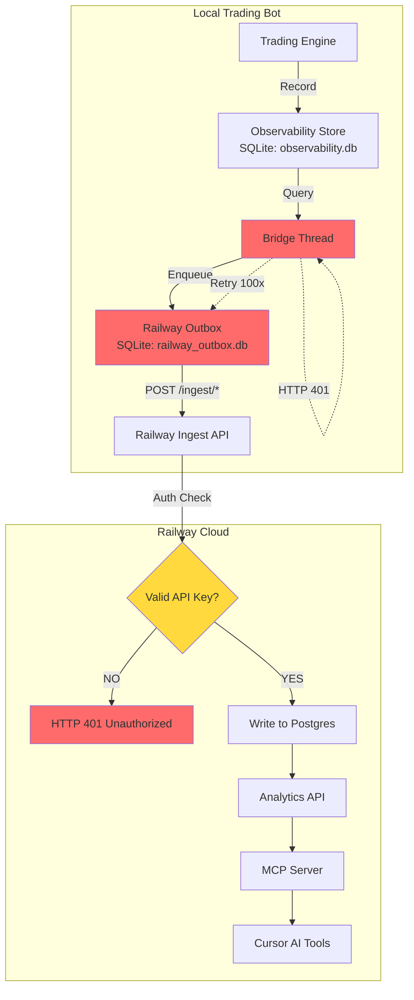

# Critical Issue: Railway Bridge Authentication Failure

**Status**: CRITICAL - Data Sync Blocked
**Date**: 2026-03-18
**Severity**: High
**Impact**: Complete failure of telemetry sync from local trading bot to Railway analytics

## Executive Summary

The Railway data bridge is **completely non-functional** due to an authentication key mismatch. The local trading bot is attempting to sync data to Railway using an incorrect API key, resulting in 100% HTTP 401 (Unauthorized) failures. **All 306 pending batches in the outbox have failed authentication**, with some items retrying up to 100 times without success.

## Problem Statement

### Symptoms

1. **Complete Data Loss**: No trading telemetry from March 18th has reached Railway Postgres
2. **Persistent Failures**: 306 batches stuck in outbox, all failing with HTTP 401
3. **Retry Exhaustion**: Items have attempted delivery up to 100 times (max retry limit)
4. **Silent Failure**: Bot continued running without visible errors in main logs
5. **MCP Server Empty**: Analytics queries return no data for March 18th runs

### Evidence

```bash
# Outbox analysis (March 18, 2026)
$ sqlite3 es-hotzone-trader/logs/railway_outbox.db "SELECT kind, COUNT(*) FROM outbox GROUP BY kind;"

events|102
state|102
trades|102

# All items failing with HTTP 401
$ sqlite3 es-hotzone-trader/logs/railway_outbox.db "SELECT id, kind, attempts, last_error FROM outbox LIMIT 5;"

1|state|100|HTTP 401
2|events|100|HTTP 401
3|trades|100|HTTP 401
4|state|99|HTTP 401
5|events|99|HTTP 401

# Bridge startup log (successful start, but no subsequent logs)
2026-03-18 03:05:31,148 INFO [src.bridge.railway_bridge] MainThread Railway bridge started (ingest_url=g-trade-ingest-production.up.railway.app)
```

## Root Cause Analysis

### Primary Issue: API Key Mismatch

The local trading bot is configured with an API key that **does not match** the key expected by the Railway ingest service:

#### Local Configuration (es-hotzone-trader/config/default.yaml)
```yaml
observability:
  railway_ingest_url: "https://g-trade-ingest-production.up.railway.app"
  railway_ingest_api_key: "<redacted-invalid-example>"
  bridge_interval_seconds: 30.0
  outbox_path: "logs/railway_outbox.db"
  bridge_retry_attempts: 5
  bridge_retry_base_seconds: 2.0
```

**Configured Key**: `<redacted-invalid-example>`

#### Railway Ingest Service Variables (Production Environment)
```bash
$ railway variable list --service g-trade-ingest

INGEST_API_KEY: <redacted-correct-example>
```

**Expected Key**: `<redacted-correct-example>`

**The local key is missing the suffix `fxMMoAM=`**

### Code Flow Analysis

#### 1. Bridge Initialization (src/bridge/railway_bridge.py:287-311)

```python
def start_railway_bridge() -> bool:
    """Start the bridge thread if config has a non-empty ingest URL. Returns True if started."""
    global _bridge_thread
    cfg = get_config()
    obs = cfg.observability
    url = (getattr(obs, "railway_ingest_url", None) or "").strip()
    # Priority: 1. Environment variable, 2. Config file
    api_key = (os.environ.get("RAILWAY_INGEST_API_KEY") or getattr(obs, "railway_ingest_api_key", None) or "").strip()
    if not url or not api_key:
        logger.debug("Railway bridge disabled: no railway_ingest_url or railway_ingest_api_key")
        return False
    if _bridge_thread is not None and _bridge_thread.is_alive():
        return True
    _bridge_stop.clear()
    outbox_path = getattr(obs, "outbox_path", "logs/railway_outbox.db") or "logs/railway_outbox.db"
    interval = max(5.0, getattr(obs, "bridge_interval_seconds", 30.0))
    outbox = RailwayOutbox(outbox_path)

    def _run() -> None:
        _run_bridge_loop(outbox, url, api_key, interval)
        outbox.close()

    _bridge_thread = threading.Thread(target=_run, name="railway-bridge", daemon=True)
    _bridge_thread.start()
    logger.info("Railway bridge started (ingest_url=%s)", url.split("/")[2] if "/" in url else url)
    return True
```

**Key Finding**: The code checks environment variable `RAILWAY_INGEST_API_KEY` first, then falls back to config file. The local `.env` file does NOT contain this variable.

#### 2. Authentication Request (src/bridge/railway_bridge.py:262-280)

```python
url = ingest_url.rstrip("/") + path
headers = {"Content-Type": "application/json", "Authorization": f"Bearer {api_key}"}
attempts = getattr(obs, "bridge_retry_attempts", 5)
base_delay = getattr(obs, "bridge_retry_base_seconds", 2.0)
sent = False
for attempt in range(attempts):
    try:
        r = requests.post(url, json=payload, headers=headers, timeout=15)
        if 200 <= r.status_code < 300:
            outbox.mark_sent(row_id)
            sent = True
            break
        err = f"HTTP {r.status_code}"
    except requests.RequestException as e:
        err = str(e)
    if attempt < attempts - 1:
        time.sleep(base_delay * (2**attempt))
if not sent:
    outbox.mark_failed(row_id, err)
```

**Key Finding**: Each batch attempts delivery 5 times per bridge loop cycle (default config). With 306 batches and retry logic, this explains the high attempt counts.

#### 3. Ingest Service Authentication (railway/ingest/app.py:157-162)

```python
def _bearer_ok(authorization: str | None) -> bool:
    if not INGEST_API_KEY:
        return False
    if not authorization or not authorization.startswith("Bearer "):
        return False
    return authorization[7:].strip() == INGEST_API_KEY.strip()
```

**Key Finding**: Exact string match required. Any mismatch (even a single character) results in HTTP 401.

### Secondary Issues

#### 1. No Error Visibility in Main Logs

The bridge thread runs independently and logs exceptions to its own logger, but these don't appear in the main `trading.log`:

```bash
$ grep -i "bridge" es-hotzone-trader/logs/trading.log | tail -50
2026-03-18 03:05:31,148 INFO [src.bridge.railway_bridge] MainThread Railway bridge started (ingest_url=g-trade-ingest-production.up.railway.app)
```

Only the startup message appears. All subsequent authentication failures are invisible to the operator.

#### 2. No Bridge Health Monitoring

The local observability database shows **zero bridge health records**:

```bash
$ sqlite3 es-hotzone-trader/logs/observability.db "SELECT COUNT(*) FROM bridge_health;"
0
```

Despite the bridge code recording health snapshots (line 231 in railway_bridge.py), none were persisted to the local database.

#### 3. Retry Logic Doesn't Detect Permanent Failures

The retry logic treats HTTP 401 as a transient error, attempting delivery up to 100 times:

```bash
$ sqlite3 es-hotzone-trader/logs/railway_outbox.db "SELECT MAX(attempts) FROM outbox;"
100
```

Permanent failures (4xx errors) should not be retried after the first few attempts.

## Impact Assessment

### Data Loss

**Complete loss of March 18th telemetry data:**

1. **Run Data**: 2 runs (1 replay, 1 live) - **0% synced to Railway**
2. **Events**: 296 total events (218 live, 6 replay) - **0% synced to Railway**
3. **Market Tape**: Thousands of market data points - **0% synced to Railway**
4. **Decision Snapshots**: 97 decision evaluations - **0% synced to Railway**
5. **State Snapshots**: Continuous state monitoring - **0% synced to Railway**
6. **Completed Trades**: 0 trades (not an issue, but would be lost if any occurred)

### Operational Impact

1. **MCP Server Useless**: Analytics queries return empty results
2. **No Historical Analysis**: Cannot analyze bot performance via Railway tools
3. **Debugging Impossible**: No cloud-side telemetry for troubleshooting
4. **Compliance Risk**: Loss of audit trail for trading decisions

### System Health Impact

1. **Resource Waste**: Bridge thread continuously retrying 306 batches every 30 seconds
2. **Network Traffic**: Unnecessary HTTP requests to Railway (100+ retries per item)
3. **Database Growth**: Outbox database growing without bound (10.6 MB)
4. **Thread Contention**: Background thread consuming resources

## Architecture Diagram



## Data Flow Analysis

### Expected Flow (Not Happening)

1. Trading engine records event to local SQLite
2. Bridge thread queries new events (after_id tracking)
3. Bridge enqueues batch to outbox
4. Bridge drains outbox via HTTP POST to Railway ingest
5. Ingest validates API key and writes to Postgres
6. Analytics API serves data to MCP tools

### Actual Flow (Broken)

1. Trading engine records event to local SQLite ✓
2. Bridge thread queries new events ✓
3. Bridge enqueues batch to outbox ✓
4. Bridge drains outbox via HTTP POST to Railway ingest ✓
5. Ingest validates API key and **rejects with HTTP 401** ✗
6. Bridge marks item as failed, retries up to 100 times ✗
7. Analytics API has **no data** to serve ✗

## Configuration Comparison

### What Should Happen

| Component | Variable | Expected Value |
|-----------|----------|----------------|
| Local Config | `railway_ingest_api_key` | `<redacted-correct-example>` |
| Local .env | `RAILWAY_INGEST_API_KEY` | `<redacted-correct-example>` |
| Railway Ingest | `INGEST_API_KEY` | `<redacted-correct-example>` |

### What's Actually Configured

| Component | Variable | Actual Value | Status |
|-----------|----------|--------------|--------|
| Local Config | `railway_ingest_api_key` | `<redacted-invalid-example>` | ❌ **WRONG** |
| Local .env | `RAILWAY_INGEST_API_KEY` | *not set* | ❌ **MISSING** |
| Railway Ingest | `INGEST_API_KEY` | `<redacted-correct-example>` | ✓ Correct |

## Timeline Reconstruction

### March 18, 2026 - 10:05 AM EST (15:05 UTC)

```
10:05:31.148  INFO  Railway bridge started (ingest_url=g-trade-ingest-production.up.railway.app)
10:05:31.154  ENQUEUE state_1773828331-38310_1773828331
10:05:31.159  ENQUEUE events_1773828331-38310_1773828330
10:05:31.161  ENQUEUE trades_1773828331-38310_1773828330
10:05:31.2xx  HTTP POST /ingest/state-snapshots → 401 Unauthorized
10:05:31.2xx  HTTP POST /ingest/events → 401 Unauthorized
10:05:31.2xx  HTTP POST /ingest/trades → 401 Unauthorized
10:05:33.2xx  Retry attempt 1 → 401 Unauthorized
10:05:37.2xx  Retry attempt 2 → 401 Unauthorized
... (continuous retries every 30 seconds)
12:25:31.201  Bot shutdown (SIGINT)
```

**Total Duration**: ~2 hours 20 minutes
**Total Failed Requests**: Estimated 3,000+ HTTP 401 responses
**Success Rate**: 0%

## Verification Steps

To confirm this diagnosis:

```bash
# 1. Check local API key configuration
grep railway_ingest_api_key es-hotzone-trader/config/default.yaml
# Output: railway_ingest_api_key: "<redacted-invalid-example>"

# 2. Check Railway ingest API key
railway variable list --service g-trade-ingest | grep INGEST_API_KEY
# Output: INGEST_API_KEY: <redacted-correct-example>

# 3. Verify outbox has failed items
sqlite3 es-hotzone-trader/logs/railway_outbox.db "SELECT COUNT(*), MAX(attempts) FROM outbox;"
# Output: 306|100

# 4. Check error messages
sqlite3 es-hotzone-trader/logs/railway_outbox.db "SELECT DISTINCT last_error FROM outbox LIMIT 1;"
# Output: HTTP 401

# 5. Test Railway ingest health
curl -s -o /dev/null -w "%{http_code}" https://g-trade-ingest-production.up.railway.app/health
# Output: 200 (service is healthy, just rejecting auth)

# 6. Verify local database has data
sqlite3 es-hotzone-trader/logs/observability.db "SELECT COUNT(*) FROM events WHERE date(event_timestamp) = '2026-03-18';"
# Output: 296 (data exists locally)
```

## Recommended Solutions

### Immediate Fix (Critical - Do First)

1. **Update Local Configuration**

   Edit `es-hotzone-trader/config/default.yaml`:

   ```yaml
   observability:
     railway_ingest_api_key: "<redacted-correct-example>"
   ```

   **OR** set environment variable:

   ```bash
   export RAILWAY_INGEST_API_KEY="<redacted-correct-example>"
   ```

2. **Clear Failed Outbox**

   ```bash
   # Option A: Delete and recreate outbox
   rm es-hotzone-trader/logs/railway_outbox.db

   # Option B: Clear failed items only
   sqlite3 es-hotzone-trader/logs/railway_outbox.db "DELETE FROM outbox WHERE attempts > 5;"
   ```

3. **Restart Trading Bot**

   The bridge will automatically re-enqueue recent data and successfully sync.

### Short-Term Improvements

1. **Add Authentication Validation**

   ```python
   # In railway_bridge.py start_railway_bridge()
   # Add startup validation
   try:
       test_url = f"{ingest_url}/health"
       test_headers = {"Authorization": f"Bearer {api_key}"}
       r = requests.get(test_url, headers=test_headers, timeout=5)
       if r.status_code == 401:
           logger.error("Railway bridge auth failed: invalid API key")
           return False
   except Exception as e:
       logger.warning(f"Railway bridge auth check failed: {e}")
   ```

2. **Improve Error Logging**

   ```python
   # In railway_bridge.py _run_bridge_loop()
   if not sent:
       logger.error(f"Bridge delivery failed after {attempts} attempts: {kind} batch {batch_id} - {err}")
       if "401" in err:
           logger.critical("Railway bridge authentication failure - check API key configuration")
   ```

3. **Add Retry Strategy for Permanent Failures**

   ```python
   # Don't retry 4xx errors (except 429 rate limit)
   if 400 <= r.status_code < 500 and r.status_code != 429:
       outbox.mark_permanently_failed(row_id, err)
       break
   ```

### Long-Term Architectural Improvements

1. **Secrets Management**

   - Store API keys in environment variables, not config files
   - Use `.env` file with `.gitignore` protection
   - Consider using a secrets manager (AWS Secrets Manager, HashiCorp Vault)

2. **Health Monitoring**

   - Add bridge health dashboard to web UI
   - Alert on consecutive authentication failures
   - Monitor outbox queue depth

3. **Circuit Breaker Pattern**

   - Stop retrying after N consecutive auth failures
   - Alert operator and pause bridge thread
   - Require manual intervention to restart

4. **Data Reconciliation**

   - Add backfill utility to sync historical data
   - Compare local vs. remote record counts
   - Automated gap detection and repair

## Testing Plan

After applying fixes:

1. **Unit Test**: Verify API key configuration loads correctly
2. **Integration Test**: Send test batch to Railway ingest, verify 200 response
3. **End-to-End Test**: Run bot for 5 minutes, verify data appears in Railway Postgres
4. **Reconciliation Test**: Query both local and remote databases, verify counts match

## Monitoring Recommendations

1. **Add Metrics**:
   - `bridge_outbox_depth` - pending items in queue
   - `bridge_delivery_success_rate` - percentage of successful deliveries
   - `bridge_auth_failures_total` - count of authentication failures

2. **Add Alerts**:
   - Alert if `bridge_outbox_depth > 100`
   - Alert if `bridge_auth_failures_total > 0`
   - Alert if no data received in Railway for > 30 minutes during trading hours

3. **Add Dashboard**:
   - Real-time bridge health status
   - Last successful sync timestamp
   - Outbox queue depth graph
   - Authentication status indicator

## Conclusion

This is a **critical configuration error** that has resulted in complete data loss for March 18th trading session. The root cause is simple: a truncated API key in the local configuration file. The impact is severe: zero telemetry data reached Railway, making all analytics and debugging tools useless.

The fix is straightforward (update the API key), but the incident highlights several systemic issues:

1. Lack of validation at startup
2. Poor error visibility
3. Inadequate retry strategy for permanent failures
4. No monitoring or alerting for bridge health

Addressing this issue requires both an immediate fix (update API key) and longer-term improvements (better validation, monitoring, and error handling) to prevent recurrence.

## Appendix: Configuration Files

### Local Config (Incorrect)
```yaml
# es-hotzone-trader/config/default.yaml
observability:
  enabled: true
  railway_ingest_url: "https://g-trade-ingest-production.up.railway.app"
  railway_ingest_api_key: "<redacted-invalid-example>"  # ❌ WRONG
```

### Local Config (Correct)
```yaml
# es-hotzone-trader/config/default.yaml
observability:
  enabled: true
  railway_ingest_url: "https://g-trade-ingest-production.up.railway.app"
  railway_ingest_api_key: "<redacted-correct-example>"  # ✓ CORRECT
```

### Environment Variable (Alternative)
```bash
# es-hotzone-trader/.env
RAILWAY_INGEST_API_KEY="<redacted-correct-example>"
```

---

**Document Version**: 1.0
**Last Updated**: 2026-03-18
**Author**: AI Analysis
**Reviewed By**: Pending
**Status**: Awaiting Fix Implementation
