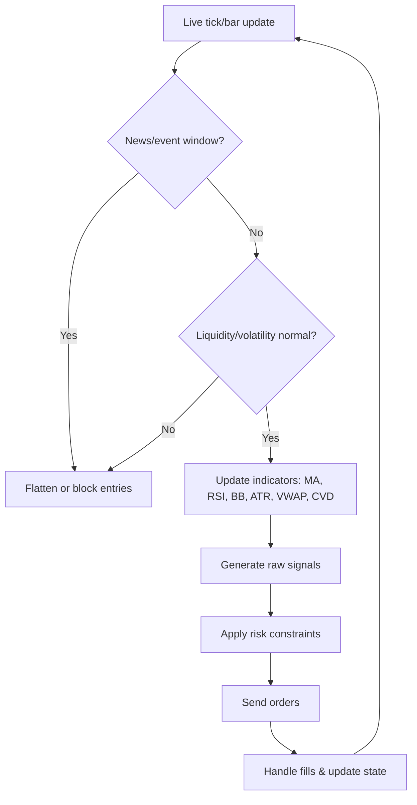
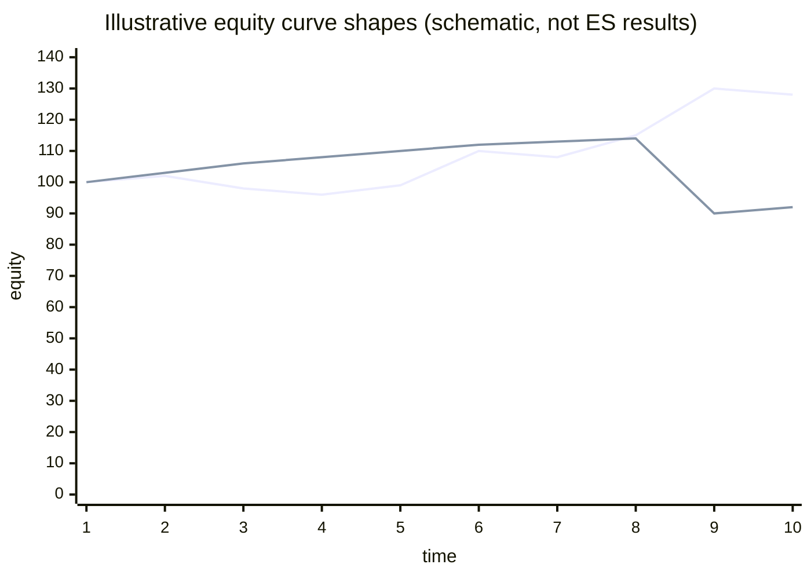
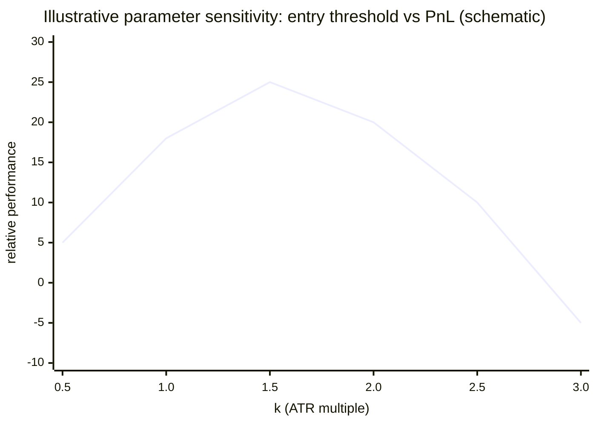

# Trading Algorithms and Indicators for E-mini S&P 500 Futures

*Reference: strategy/research only. Current operator interface is CLI-only; see [../README.md](../README.md) and [../OPERATOR.md](../OPERATOR.md).*

## Executive summary

The E-mini S&P 500 futures contract (ES) is a highly liquid, electronically traded equity index future with a $50 multiplier and a minimum price fluctuation (“tick”) of 0.25 index points ($12.50). citeturn28view0turn27search0 Because ES trades on an electronic limit order book for most of the week (nearly 24-hour access starting Sunday evening) and is tightly arbitraged to the underlying equity index through “cost of carry,” most persistent edges are either (a) **slow enough** to survive fees and noise (medium-term trend or macro/risk regimes) or (b) **microstructure-aware** enough to monetize short-horizon supply/demand and liquidity effects without being wiped out by slippage. citeturn28view0turn31view2turn2search1

Across the literature and industry practice, the strategy families that tend to be most defensible (in the “survives parameter drift and regime changes” sense) are:

- **Time-series momentum / trend following** (medium-term) with **volatility scaling** and conservative turnover. Large-sample evidence across futures markets supports trend-following’s long-run viability; ES is typically one component within these diversified futures portfolios. citeturn11search0turn11search24  
- **Intraday liquidity/flow strategies** that explicitly model auction structure and order-flow (volume profile, cumulative delta, imbalance) and that treat fills/slippage as first-class concerns—especially around macro news, when ES price–flow dynamics and volatility change sharply. citeturn2search1turn11search15turn4search0turn31view2  
- **Statistical arbitrage / basis convergence** (ES vs. cash index / proxies) grounded in cost-of-carry and limits-to-arbitrage dynamics—conceptually clean, but operationally sensitive to execution costs, financing assumptions, and hedging instrument choice. citeturn28view0turn12search7turn12search11

Indicator-wise, ES traders repeatedly converge on a compact toolkit that maps cleanly to market structure:

- **Trend**: moving averages, MACD. citeturn30search0turn3search17  
- **Mean/extension**: Bollinger Bands, RSI. citeturn30search3turn30search16  
- **Volatility/risk sizing**: ATR (and realized volatility variants). citeturn30search10turn28view0  
- **Execution/“fair price” anchors**: session VWAP and anchored VWAP concepts (especially for intraday mean-reversion and “who is trapped where” reasoning). citeturn3search2turn4search8turn4search12  
- **Order-flow / auction structure**: volume profile/market profile, cumulative volume delta, footprint/volumetric bars (requires tick/volume-at-price data and careful definitions). citeturn31view1turn4search0turn4search14turn4search10

A central finding from modern backtesting research is that ES strategies are especially prone to **selection bias** because the data is rich and the number of plausible variants is enormous; robust research design (walk-forward, purging/embargoing, multiple-testing corrections such as deflated Sharpe / PBO-style procedures) is not optional if you want believable results. citeturn1search20turn1search32turn1search28

## ES futures market structure and data realities

### Contract economics and mechanical constraints

ES is an equity index future with a **$50 × index** contract multiplier and **0.25 index-point tick** (=$12.50). citeturn28view0turn27search0 ES contracts list on the March quarterly cycle (Mar/Jun/Sep/Dec), are **cash-settled**, and their “basis” versus the cash index reflects financing costs and expected dividends (“cost of carry”). citeturn28view0 These properties matter directly for algorithm design: roll handling, continuous contract construction, and (for spread/basis strategies) what you treat as “fair value.” citeturn28view0turn12search7

### Microstructure: limit order book, order-flow, and regime shifts

ES trades on an electronic order book, so short-horizon strategies live or die on (i) **bid/ask dynamics**, (ii) **queue position / fill probability**, and (iii) time-of-day and event regimes. citeturn31view2turn11search11 Around major scheduled announcements (e.g., FOMC statements), research on ES limit-order behavior documents “higher-than-normal” volatility and volume and meaningful changes in liquidity conditions. citeturn11search15 Recent work modeling ES at one-second frequency finds that macro news can “reshape” the relationship between returns and order-flow imbalance (price impact rises, volatility spikes, flow dynamics change), reinforcing the need for event filters and regime-aware risk limits in intraday strategies. citeturn2search1

### Data requirements (why frequency and depth matter)

For ES, the “right” data depends on the strategy:

- **Daily to 1–5 minute bars** can support many trend/mean-reversion systems (moving averages, Bollinger, RSI, ATR, MACD) and can be reasonably backtested with bar-based fills if you model slippage conservatively. citeturn30search0turn30search10turn3search17  
- **1-second and tick trade/quote data** becomes important when you rely on order-flow imbalance, short-lived microstructure signals, or when you must model intrabar stop/limit logic realistically. citeturn2search1turn4search0turn13search22  
- **Full-depth market-by-order / market-by-price feeds** are required for market-making and serious order-book ML. CME market depth files (via its historical data products) are designed to reconstruct the order book (depth-of-book) with millisecond timestamps. citeturn31view1turn31view2

A practical implication: if your “edge” is supposed to come from footprint/cumulative-delta/volume-at-price nuances, but your dataset lacks reliable bid/ask classification at tick granularity, you may be testing a different strategy than you think. citeturn4search0turn4search2

## Indicator toolkit for ES

This section focuses on the indicators you listed, but frames them by **what they measure** (trend, mean/extension, volatility, flow/structure) and **what data they require**.

### Trend and momentum indicators

**Moving averages (SMA/EMA)** compress noise and define trend direction/slope; they are explicitly trend-following and therefore lag by construction. citeturn30search0 ES-specific usage patterns often include:
- trend filters (e.g., “only trade long if price > long MA”),
- crossovers (fast MA vs slow MA),
- slope/angle thresholds for regime detection. citeturn30search0

**MACD** transforms moving averages into a momentum-style oscillator (difference between fast and slow EMAs, with a signal line). It is widely used to measure changes in trend strength and momentum, but inherits lag and can overtrade in ranges. citeturn3search17turn3search5

### Mean-reversion and extension indicators

**RSI** (developed by entity["people","J. Welles Wilder Jr.","technical analyst"]) is a momentum oscillator commonly used to identify short-horizon “overbought/oversold” conditions, with the classic 14-period default coming from Wilder’s original specification. citeturn30search16turn28view0 In ES, RSI is most defensible as an **extension detector** inside a broader regime filter (e.g., only fade in a confirmed range, not in a high-momentum trend). citeturn30search16turn2search17

**Bollinger Bands** (popularized by entity["people","John Bollinger","technical analyst"]) set bands around a moving average using standard deviation; the textbook default is 20 periods and 2 standard deviations, but the creator explicitly emphasizes these are defaults and should be adapted to task and market. citeturn30search3turn30search11turn3search12 ES usage splits into two opposing logics:
- **Squeeze / breakout**: low band width → anticipate expansion. citeturn30search3turn30news43  
- **Mean-reversion fade**: price touches/penetrates outer band and then reverts to the mean—works primarily in range regimes (fails in breakouts). citeturn30search7turn30news43

### Volatility and risk-sizing indicators

**ATR** (also introduced by Wilder) measures volatility via true range and is commonly used for position sizing, stop distances, and “volatility regime” filters. citeturn30search10turn30search2 In ES, ATR is especially useful because it helps normalize risk across changing volatility (including event spikes). citeturn11search15turn2search1

### VWAP family: execution-centric “fair price” anchors

**VWAP** is both (i) an execution benchmark and (ii) a descriptive “where most volume traded” anchor; optimal execution under VWAP benchmarks is a formal subject in execution research. citeturn3search2turn3search26 For intraday ES strategies, VWAP-based mean reversion is best viewed as a hypothesis about institutional execution and auction “gravity,” not as a stand-alone trading rule. citeturn3search2turn28view0

**Anchored VWAP** starts VWAP from a user-chosen anchor point (event, swing high/low, session open, etc.) and is widely used as a contextual support/resistance tool. citeturn4search8turn4search12 A large practical risk: anchor choice can become unintentionally discretionary (“research degrees of freedom”), increasing overfitting risk unless anchors are rule-defined (e.g., “anchor at prior day high,” “anchor at FOMC release timestamp”). citeturn4search8turn1search32

### Order-flow and auction structure indicators

**Volume profile / market profile concepts** focus on *where* trading occurred by price (and/or time), producing levels such as Point of Control (POC) and value areas that traders treat as structural reference points. citeturn2search11turn31view1 These tools are common in ES discretionary and hybrid systematic trading, but must be operationalized carefully (exact session boundaries, inclusion/exclusion of overnight, etc.). citeturn28view0turn31view1

**Cumulative Volume Delta (CVD)** aggregates bid/ask-side volume imbalance over time and is explicitly tick-data-dependent for accuracy; platform documentation defines it as cumulative (ask-side − bid-side) volume (or related constructions). citeturn4search0turn4search14turn4search9

**Footprint / volumetric bars** visualize volume-at-price inside bars and are often combined with delta/imbalance cues. Platform guidance emphasizes they are interpretive tools and can be misused if traders treat every imbalance as a signal or ignore context. citeturn4search10turn4search22

image_group{"layout":"carousel","aspect_ratio":"16:9","query":["E-mini S&P 500 volume profile example chart","ES futures footprint chart volumetric bars example","cumulative delta chart futures example","anchored VWAP chart example"],"num_per_query":1}

## Algorithm families and concrete designs

This section gives **rigorous, implementation-oriented templates** for each requested algorithm type. The goal is not to claim a single “best” rule-set, but to show designs that (a) map to ES microstructure and (b) can be backtested honestly.

### Trend-following

#### Rationale and evidence base  
Trend following (time-series momentum) has extensive evidence across futures markets over long samples, and major practitioner research argues it has persisted across decades and macro environments. citeturn11search0turn11search24turn11search1 Because ES is a single market and trend edges are noisy, trend models are most robust when they (i) keep turnover modest and (ii) scale risk by volatility rather than by conviction. citeturn11search0turn28view0

#### Concrete design: MA/volatility-scaled breakout (intraday or swing)

**Signal layer**
- Trend filter: price above a slow MA (e.g., EMA 100 on 1–5 minute bars intraday; or SMA 200 on daily). citeturn30search0  
- Entry trigger: breakout above recent high (e.g., N-bar Donchian high) *or* fast MA crosses above slow MA.  
- Optional momentum confirmation: MACD histogram > 0. citeturn3search17

**Execution layer**
- Prefer stop-limit or limit-on-pullback entries when liquidity is stable; default to marketable orders during fast breakouts only if your slippage model justifies it. (This is an execution-design principle consistent with market impact research: aggressive orders pay spread/impact; passive orders risk non-fill.) citeturn1search23turn3search2

**Risk and sizing**
- Volatility targeting: position size ∝ (target $ risk) / (ATR × $/point). ATR is commonly used for this normalization. citeturn30search10turn28view0  
- Hard stop: k × ATR from entry, with k chosen by timeframe (smaller intraday, larger swing).  
- Trailing stop: max(fixed ATR trail, swing-low trail), to “let profits run,” consistent with trend logic. citeturn11search0

**Exit logic**
- Regime exit: close if price crosses below slow MA (trend broken). citeturn30search0  
- Time-based exit (intraday): close before settlement/illiquid maintenance windows; ES behavior differs by session and can be impacted by scheduled times. citeturn28view0turn11search15

### Mean-reversion

#### Rationale and where it tends to work  
Mean reversion in ES is most credible when interpreted as **liquidity provision / inventory mean reversion** or as reversion conditional on volatility and market stress (i.e., not a blanket “RSI<30 → buy”). Work on return reversal and liquidity provision supports the idea that contrarian returns can proxy for providing liquidity, especially when liquidity evaporates. citeturn2search17turn2search7

#### Concrete design: Bollinger + RSI fade with regime filter

**Signal layer**
- Range regime gate: require low trend strength (e.g., MA slope near zero; or band width below threshold to avoid fading breakouts). Bollinger’s “squeeze” concept is a warning: low volatility can precede expansion, so fading in squeeze regimes is risky unless you explicitly model it. citeturn30news43turn30search3  
- Long setup: close below lower Bollinger Band AND RSI below a threshold (e.g., 30). Short setup symmetrical. citeturn30search16turn30search3

**Execution layer**
- Entry: limit order near the band edge (or first pullback) to reduce spread costs; market orders tend to bleed edge in mean-reversion systems with high turnover. (Execution-cost sensitivity is a core issue in short-horizon strategies.) citeturn1search23turn2search17

**Risk and sizing**
- Stop: k × ATR beyond the band (or beyond the recent swing). ATR-based stops put stops in volatility units rather than arbitrary points. citeturn30search10  
- Size: smaller than trend systems at the same risk budget because tail risk (breakout continuation) is structurally higher for fades.

**Exit logic**
- Primary exit: mean reversion to mid-band (the moving average) or to VWAP (if you explicitly interpret VWAP as “fair price”). citeturn30search7turn3search2  
- Fail-safe: time stop (exit if no revert within M bars), to avoid dying by a thousand cuts during trend days.

### Statistical arbitrage

#### Rationale: basis, cointegration, and limits to arbitrage  
Stock index futures pricing is tied to the cash index via cost-of-carry relationships; deviations are “basis” and should mean revert within bounds determined by transaction costs and arbitrage frictions. citeturn28view0turn12search7turn12search11 Empirical work on index arbitrage shows nonlinear/threshold dynamics consistent with “discontinuous arbitrage” (arbitrage only when mispricing is large enough). citeturn12search7turn12search11

#### Concrete design: ES–cash proxy basis band strategy

Because directly trading the full cash basket is operationally intensive, many practical implementations use liquid proxies (e.g., an ETF) while treating the theoretical model as a guide rather than truth. Research on futures–cash relationships motivates threshold-based entry/exit rules rather than continuous trading. citeturn12search7turn12search11turn28view0

**Signal layer**
- Compute “observed basis” = ES_price − proxy_price_adjusted.  
- Estimate “fair basis” via cost-of-carry (financing − dividends) or via statistical filtering (e.g., rolling mean). Cost-of-carry logic is directly discussed in CME’s educational material. citeturn28view0  
- Trade when basis deviates beyond ±B, where B includes estimated transaction costs and a buffer for model error (transaction-cost bands are central to the arbitrage literature). citeturn12search7turn12search11

**Execution layer**
- Use limit orders where possible; spread costs apply on both legs.  
- Synchronize execution (or use spread order types where supported) to reduce leg risk.

**Risk**
- Primary risk is not “directional SPX,” but **spread blowout** under stress and **execution mismatch** across legs (partial fill, latency, differing trading hours/liquidity). Event filters matter. citeturn11search15turn2search1

### Market-making

#### Rationale and reality check for ES  
Market making on ES is theoretically well studied in limit-order-book models, but practically extremely competitive; without low latency, queue priority, and robust fill modeling, backtests often assume fills you won’t get live. citeturn31view2turn12search33

A canonical framework is the Avellaneda–Stoikov model (reservation price + optimal spread as a function of inventory risk and volatility), which has spawned extensive follow-on work and practical adaptations. citeturn1search22turn1search26

#### Concrete design: inventory-aware two-sided quoting (conceptual)

**Quote logic**
- Compute midprice (from best bid/ask).  
- Set reservation price = mid − inventory_penalty, where penalty grows with inventory and volatility.  
- Quote bid/ask around reservation price with spread widened in high volatility.

**Inventory and risk**
- Hard inventory limits: do not exceed max contracts.  
- Volatility circuit-breaker: stop quoting during defined event windows (macro releases) or when short-term realized volatility exceeds threshold (documented to spike around announcements). citeturn11search15turn2search1

**Fills**
- Model fill probabilities explicitly (queue position, order book depth). Fill-probability modeling is a first-class research topic and is crucial for avoiding optimistic backtests. citeturn12search33turn31view2

### Machine learning

#### What ML is good for in ES (and what it isn’t)  
Machine learning can help when:
- microstructure features are rich (order book, imbalance, event flags), and  
- the target is well defined (e.g., next k-second midprice move, short-horizon volatility, fill probability),  
but it is not a magic substitute for execution modeling and overfitting control. citeturn12search1turn12search2turn1search20

Deep learning for limit order books (exemplified by DeepLOB and related work) shows that order book history contains predictive structure in some settings and can generalize across instruments, but these results do not automatically translate into tradable ES alpha after costs—especially at very short horizons. citeturn12search1turn12search2turn12search21

#### Concrete design: LOB classifier + conservative trading wrapper
- Features: normalized L1–L10 depth (MBP), imbalance, recent trades, volatility estimate, and event flags (macro calendar). MDP 3.0 explicitly supports full-depth/10-deep book and time-and-sales. citeturn31view2turn11search15  
- Model: predict probability of up-move over horizon H (e.g., 1–5 seconds). citeturn12search1turn2search1  
- Trading wrapper: only trade when predicted edge exceeds a **cost + uncertainty buffer** and when liquidity is normal; otherwise no-trade.

### Hybrid strategies (often best for ES in practice)

Hybrid designs combine:
- a **regime detector** (trend vs range, calm vs event/stress), and  
- a regime-appropriate sub-strategy (trend-following vs mean-reversion).  

This structure is pragmatic for ES because the market alternates between strongly trending sessions (where fades get crushed) and balanced, mean-reverting auctions (where trend systems chop). Event-driven regime shifts documented in the ES microstructure literature strengthen the case for explicit regime gates. citeturn2search1turn11search15turn30news43

## Parameterization, sensitivity, and backtesting

### Data frequency selection: tick vs second vs minute

A practical frequency hierarchy for ES strategy research is:

- **Minute bars (1m–5m)** for classic indicator systems (MA, RSI, Bollinger, ATR, MACD) and for many intraday hybrids, because it reduces microstructure noise and makes backtests tractable. citeturn30search0turn30search16turn30search10turn3search17  
- **Second bars / tick** when your signal horizon is seconds, when you care about order-flow imbalance dynamics, or when you need intrabar stop realism. Empirical ES research uses one-second frequency specifically to capture intraday variation and aggregation effects. citeturn2search1turn13search22  
- **Full depth (MBO/MBP)** when you model the order book (market making, queue models, LOB ML). CME market depth data is designed to reconstruct the book and is timestamped to the millisecond. citeturn31view1turn31view2

### Parameter choices and ranges (with ES-specific heuristics)

The values below are not “optimal,” but represent defensible starting ranges that you can stress-test.

- Moving averages: 20–200 periods depending on timeframe; use slope/position as regime filters rather than relying solely on crossovers. citeturn30search0  
- RSI: 7–21 periods, with 14 as a canonical baseline; thresholds (e.g., 30/70) should be treated as regime-dependent, not universal. citeturn30search16turn28view0  
- Bollinger Bands: 10–50 period lookback and 1.5–2.5 std-dev multipliers; creator guidance emphasizes defaults are not universal. citeturn30search11turn30search3  
- ATR: 10–30 period for volatility estimation; ATR is often used for stops/sizing rather than as a directional signal. citeturn30search10turn30search2  
- VWAP / anchored VWAP: define session boundaries and anchor rules *mechanically* to avoid discretionary degrees of freedom. citeturn4search8turn4search12  
- Order-flow metrics (CVD/footprint): require consistent trade classification and tick-by-tick integrity; platform docs explicitly warn that lack of tick data harms accuracy. citeturn4search0turn4search2

### Overfitting controls and walk-forward design

Because ES strategies are frequently developed by evaluating many variants (indicator parameters, filters, session definitions, stop logic), controlling for overfitting is central. Research on backtest overfitting and selection bias proposes frameworks such as probability of backtest overfitting (PBO) and deflated Sharpe ratio adjustments to account for multiple testing and non-normal returns. citeturn1search32turn1search20 A practical, rigorous workflow is:

- Split history into **multiple contiguous regimes** (calm, crisis, high-vol, rate shocks) rather than one random train/test split. citeturn11search0turn2search1  
- Use **walk-forward**: optimize on window W, test on next window T, roll forward; report distribution of results across folds, not just one “out-of-sample.” citeturn1search32turn1search20  
- Apply **multiple-testing-aware metrics** (deflated Sharpe; PBO) and penalize complexity. citeturn1search20turn1search28  
- Run **cost stress tests**: double commissions/slippage and confirm the strategy still survives, especially for high-turnover systems.

### Slippage, commissions, and fill modeling (what “rigorous” means)

Short-horizon ES strategies are often “killed” not by signal failure but by execution assumptions. A rigorous backtest should:

- Separate **signal price** (mid/last) from **fill price**, and model that aggressive orders pay spread/impact while passive orders face non-fill and adverse selection. Optimal execution research formalizes the idea that execution schedules trade off cost vs risk and that benchmark choices like VWAP are meaningful. citeturn1search23turn3search2  
- Model stop/limit logic at the correct granularity. If you backtest on 1m bars but your stops are 2–3 ticks, you must simulate intrabar path or use higher-frequency data; otherwise you get path-dependent bias.

### Performance metrics that matter for ES strategies

A single Sharpe is not enough; ES strategies often have skew, fat tails, and regime dependence.

Key portfolio-level metrics:
- **Sharpe ratio** (reward-to-variability) traces to entity["people","William F. Sharpe","economist"]’s classic mutual fund performance measure; use it, but recognize its limitations under non-normality and multiple testing. citeturn29search0turn1search20  
- **Sortino ratio** focuses on downside deviation; CFA Institute discussions emphasize its usefulness as a complement and note implementation variations. citeturn29search1turn29search29  
- **Max drawdown** and **MAR ratio (CAGR / max drawdown)** for “how painful is it to hold”; MAR is commonly used for trading programs. citeturn29search2  

Trade-level diagnostics (especially for intraday ES):
- win rate, average win/loss, payoff ratio, expectancy (average profit per trade given win rate and payoff), MAE/MFE, time-in-trade, and slippage per trade. (Expectancy formalizations are widely used in trading analytics.) citeturn29search11turn29search3  

## Implementation notes for production trading

### Latency and execution architecture

Latency sensitivity depends on strategy class:

- **Medium-term trend**: low latency requirement; execution quality still matters, but co-location is unnecessary. citeturn11search0turn1search23  
- **Intraday mean reversion / VWAP**: moderate; you need reliable order handling and stable data, but not microsecond infrastructure. citeturn3search2turn13search0  
- **Order-flow scalping / market making**: high; ES order latency and participant behavior have been studied explicitly, underscoring that “speed” is a strategic variable, not a detail. citeturn11search11turn31view2

### Platforms and APIs

Below are implementation-relevant notes tied to official documentation:

- In NinjaTrader, strategy reliability often hinges on using execution-driven callbacks for fill-aware logic (the platform explicitly cautions to use execution events rather than order-update events when driving logic based on fills). citeturn13search0turn13search8  
- TradeStation provides built-in stop and profit target commands (e.g., SetStopLoss / SetProfitTarget) that generate exit orders once thresholds are hit; these are helpful but must be tested carefully for bar-by-bar evaluation assumptions. citeturn13search1turn13search5turn13search21  
- QuantConnect’s LEAN framework supports futures data at tick/second/minute resolutions and discusses live tick grouping behavior; this matters for microstructure strategies and for reconciling backtest vs live behavior. citeturn13search10turn13search22turn13search18  
- “IB” implementations often use entity["company","Interactive Brokers Group","brokerage ibkr"] APIs (TWS/IB Gateway). Official docs show order submission via placeOrder and outline order-type support, but you must validate market permissions and data entitlements for futures. citeturn13search7turn13search39turn13search19

### kdb+ style research stacks (tick data engineering)

For high-frequency ES research, a common institutional pattern is to store and query ticks/order book data in kdb+ architectures with a tickerplant, real-time database, and historical database. KX documentation describes how a tickerplant logs and publishes data to subscribers (RDB), with end-of-day processes writing down to history. citeturn14search0turn14search1 The modern Python integration stack (PyKX) supports embedding q in Python and IPC querying, enabling feature engineering pipelines in Python with kdb+-resident data. citeturn14search2turn14search25

### Recommended datasets and primary sources for ES research

For ES-specific strategy work, the most defensible data sources are those derived directly from exchange-grade feeds:

- **Historical market depth / order book reconstruction** from CME historical offerings: market depth files include the messages required to recreate the order book (depth-of-book) and are timestamped to the millisecond. citeturn31view1  
- **MDP 3.0 service documentation** describing market-by-order full depth, market-by-price depth, statistics, time-and-sales, and dissemination mechanics. citeturn31view2  
- **CME DataMine catalog** (settlements, market-by-order, packet capture) for rigorous backtesting and replay. citeturn31view0  
- Third-party/derived datasets (useful for prototyping but validate definitions): entity["company","DataBento","market data vendor"] examples and conventions for futures data; QuantConnect’s US Futures dataset (sourced from AlgoSeek) and its supported resolutions. citeturn15search17turn13search26turn13search18  
- Academic-grade vendor datasets (for papers): some ES studies use Refinitiv/Thomson Reuters tick histories; always check whether you have trades-only vs trades+quotes vs depth. citeturn11search39turn2search26

## Practical recommendations and comparison tables

### Comparative table: algorithm families for ES

The table below is a *strategy engineering* comparison (not a promise of returns). It is grounded in the data and market-structure realities cited earlier: ES is tightly arbitraged with event-driven microstructure shifts, and full-depth book data exists but is complex and expensive. citeturn28view0turn31view1turn2search1turn1search20

| Strategy family | Typical holding period | Data needed | Latency sensitivity | Expected turnover | Primary risk / failure mode | Complexity |
|---|---:|---|---|---:|---|---|
| Medium-term trend following | days–months | daily bars (or 60m) | low | low | long drawdowns, whipsaws in range regimes | medium |
| Intraday trend/breakout | minutes–hours | 1m–5m (optionally 1s) | medium | medium–high | chop, news spikes, slippage on stops | medium |
| Intraday mean reversion (BB/RSI/VWAP) | minutes–hours | 1m–5m + volume | medium | high | trend days / breakouts, cost drag | medium |
| Stat arb (basis / spreads) | seconds–days | multi-instrument synced data | medium–high | medium | leg risk, funding/model error, stress blowouts | high |
| Market making | milliseconds–seconds | full depth (MBO/MBP), tick | very high | very high | adverse selection, queue disadvantage | very high |
| ML (LOB / flow predictive) | milliseconds–minutes | tick + depth + calendar | high | high | overfitting, non-stationarity, costs | very high |
| Hybrid regime-switching | minutes–months | depends on sub-strats | medium | medium | regime misclassification | high |

### Performance metrics table (definitions and pitfalls)

These definitions rely on standard references for Sharpe/Sortino/MAR and modern warnings about multiple testing in trading backtests. citeturn29search0turn29search1turn29search2turn1search20turn1search28

| Metric | What it measures | Why it matters for ES | Common pitfall |
|---|---|---|---|
| Sharpe | average excess return per unit volatility | baseline comparability | inflated by selection bias / non-normality |
| Sortino | return per unit downside deviation | ES has crash/tail risk and skew | inconsistent target definition |
| CAGR | compounding growth | long-run viability | hides drawdown pain |
| Max drawdown | worst peak-to-trough loss | holding feasibility | regime-dependent; sample-size sensitive |
| MAR (CAGR / max drawdown) | “return per unit worst pain” | practical robustness metric | depends on inception window |
| Expectancy | average P/L per trade | microstructure strategies need positive expectancy after costs | ignores tail losses without distribution checks |
| Trade stats (hit rate, payoff, MAE/MFE, slippage) | micro-level behavior | reveals where edge actually comes from | misleading if fills unrealistic |

### Top five ES algorithm + indicator combinations

These are the most practical “best-of-class” combinations *by robustness-to-regime, clarity of implementation, and alignment between indicator meaning and ES market structure*. They are intentionally diversified across time horizons and infrastructure requirements.

#### Volatility-scaled time-series momentum overlay (MA + ATR)

**Indicators**: long MA regime filter + ATR volatility scaling. citeturn30search0turn30search10turn11search0  
**Design**: hold long/short based on trend sign (e.g., MA slope or price vs MA), size to target volatility, rebalance infrequently, roll contracts systematically. citeturn11search0turn28view0  
**Pros**: strongest long-horizon evidence base across futures; relatively insensitive to microstructure; easier to backtest honestly. citeturn11search0turn11search24  
**Cons**: can underperform in sideways regimes; drawdowns can be long; ES alone is less diversified than multi-asset implementations. citeturn11search0turn11search13  
**When to use**: if you want a systematic, research-defensible ES component without requiring tick/depth data.

#### Intraday VWAP mean reversion with volatility/event gates (VWAP + ATR + RSI)

**Indicators**: session VWAP, ATR, RSI for extension, plus hard event filters (macro calendar). citeturn3search2turn30search10turn30search16turn2search1  
**Design**: only trade in “balanced” regimes; enter when price deviates from VWAP by k×ATR and RSI confirms extension; exit at VWAP or partial at midline; stop at ATR multiple. citeturn3search2turn30search10  
**Pros**: interpretable; maps to execution/auction intuition; can be implemented on 1m–5m bars. citeturn3search2turn28view0  
**Cons**: high turnover; extremely sensitive to transaction costs and to “trend day” failures; must avoid news windows where ES dynamics shift. citeturn2search1turn11search15turn1search23  
**When to use**: if you have realistic cost models and are willing to trade selectively (not “always on”).

#### Bollinger squeeze → breakout continuation (Bollinger Bands + moving average filter + ATR trailing)

**Indicators**: Bollinger Band width (“squeeze”), moving average trend filter, ATR trailing stop. citeturn30news43turn30search0turn30search10  
**Design**: detect low-volatility compression; take breakout in direction of higher-timeframe trend; manage with ATR-based trail and time stop. citeturn30news43turn11search0  
**Pros**: coherent logic (volatility expansion); avoids the classic error of fading the squeeze. citeturn30news43  
**Cons**: false breakouts; needs careful stop logic and slippage modeling. citeturn1search23turn11search15  
**When to use**: in environments where ES “coils then moves” (often around session transitions), but only with strong risk controls.

#### Order-flow imbalance / CVD confirmation scalper (CVD + volume profile + micro stops)

**Indicators**: cumulative delta, volume profile levels, footprint/volumetric imbalances (as features), often combined with VWAP anchors. citeturn4search0turn4search14turn4search22turn31view1  
**Design**: trade around key auction levels (value edge/POC/VWAP) when delta divergence suggests absorption/exhaustion; use tight invalidation and strict timeouts. Research on ES order flow imbalances and intraday dynamics provides a structural basis for monitoring flow–return relationships, especially with regime awareness. citeturn2search1turn11search15  
**Pros**: best aligned with ES microstructure; can exploit short-lived flows. citeturn2search1turn31view2  
**Cons**: requires tick-level integrity and/or depth feeds; backtests are easy to overfit; execution dominates. citeturn4search0turn31view1turn1search20  
**When to use**: only if you can source high-quality tick/depth data and you treat execution modeling as a core deliverable.

#### Threshold-based ES–cash proxy basis reversion (basis + volatility filter + conservative band)

**Indicators**: basis (ES − proxy), volatility filter (ATR/realized vol), optional session VWAP for execution timing. citeturn28view0turn12search7turn30search10  
**Design**: trade only when mispricing exceeds a cost-informed threshold; exit when basis normalizes; control leg risk and news exposure. Nonlinear/threshold dynamics in futures–cash relationships are empirically documented. citeturn12search7turn12search11  
**Pros**: grounded in market structure; “why it should work” is clearer than many indicator-only edges. citeturn28view0turn12search7  
**Cons**: operational complexity; hedging instrument imperfections; stress regimes can break assumptions. citeturn11search15turn2search1  
**When to use**: if you can execute both legs reliably and can model financing/dividend assumptions conservatively.

### Sample pseudocode templates

Below is pseudocode that shows how to structure a fill-aware ES strategy with explicit slippage/cost modeling and regime gates. (It is illustrative; the core rigor is in your data + execution assumptions.) citeturn1search20turn1search23

```text
# PSEUDOCODE: Regime-gated intraday VWAP mean reversion (ES)

Inputs:
  bar_interval = 1m
  atr_len = 14
  rsi_len = 14
  vwap_session = "RTH" or "ETH+RTH" (must be explicit)
  entry_k = 1.5      # deviation in ATR units
  stop_k  = 2.0
  time_stop_minutes = 45
  news_blackout = list of (timestamp +/- window)

State:
  position = 0  # -1 short, +1 long
  entry_price, entry_time
  costs = commission_per_contract + estimated_slippage_ticks * tick_value

On each bar close:
  if now in news_blackout: flat(); return

  vwap = session_vwap(...)
  atr  = ATR(atr_len)
  rsi  = RSI(rsi_len)
  dev  = (close - vwap) / atr

  regime_ok = (abs(slope(MA_slow)) < slope_threshold) AND (bandwidth(BB) not in squeeze_breakout)
  if not regime_ok:
     manage_only_exits()
     return

  if position == 0:
     if dev <= -entry_k AND rsi <= 35:
        enter_long(limit=close - 1 tick)   # prefer passive
        set_stop(entry_price - stop_k*atr)
        set_profit_target(vwap)
     if dev >= +entry_k AND rsi >= 65:
        enter_short(limit=close + 1 tick)
        set_stop(entry_price + stop_k*atr)
        set_profit_target(vwap)

  else:
     if time_since(entry_time) > time_stop_minutes:
        exit_market()
     if position > 0 and close >= vwap:
        exit_limit(vwap)
     if position < 0 and close <= vwap:
        exit_limit(vwap)

Backtest fill model:
  - limit fills: must touch AND respect queue/slippage assumptions
  - stops: simulate intrabar touch or use higher-frequency data
  - apply costs per round-trip
```

### Mermaid flowcharts

```mermaid
flowchart TD
  A[Ingest market data] --> B[Clean & align sessions]
  B --> C[Build features/indicators]
  C --> D[Regime filter]
  D -->|Trend| E[Trend module]
  D -->|Range| F[Mean-reversion module]
  D -->|Event/high vol| G[Reduce risk or flat]
  E --> H[Position sizing (vol targeting)]
  F --> H
  G --> H
  H --> I[Order generation]
  I --> J[Execution model (limit/market, slippage)]
  J --> K[Risk checks: stops, max DD, inventory]
  K --> L[Trade log + metrics]
  L --> M[Walk-forward validation]
  M --> N[Deploy + monitor drift]
```



### Illustrative charts

The following are **schematic** (not empirical ES backtests). They illustrate the *shape* differences between trend and mean-reversion equity curves and how parameter choice can change outcomes—reinforcing why multiple-testing adjustments and walk-forward validation are necessary. citeturn1search20turn1search32turn11search0





## Closing note on rigor and safety

Futures trading is leveraged and can produce losses exceeding initial margin; CME educational material explicitly emphasizes leverage via contract multipliers and tick values, and ES event regimes can shift liquidity/volatility rapidly. citeturn28view0turn2search1turn11search15 The most reliable path to “best” in ES is therefore not a single indicator combo, but a **research discipline**: match strategy type to data and latency reality, model execution, and apply strict overfitting controls before trusting any backtest. citeturn1search20turn1search32turn31view1