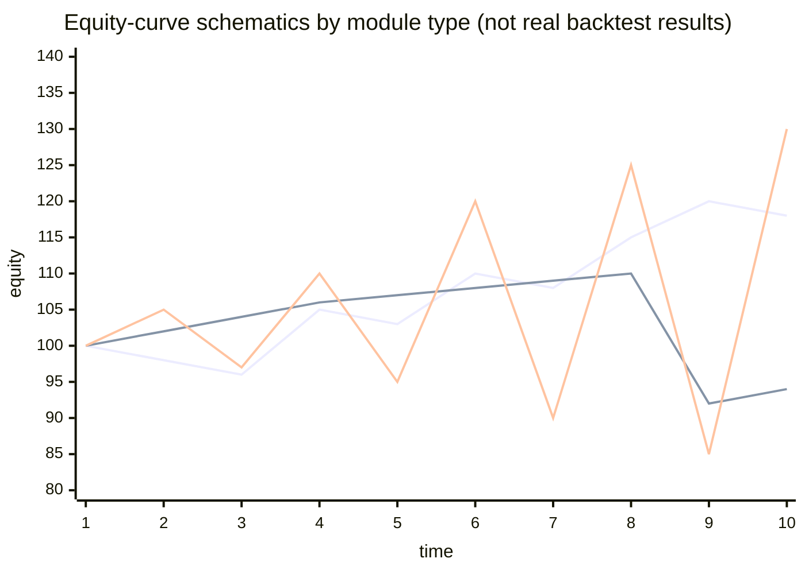
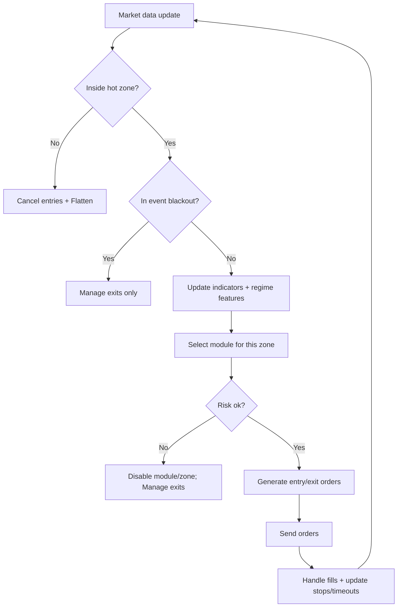
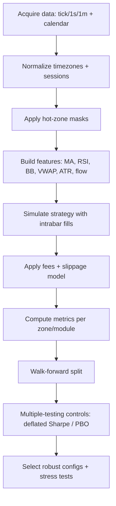

# Designing an ES Day‑Trading Algorithm That Trades Only in Intraday Hot Zones

*Reference: strategy/research only. Current operator interface is CLI-only; see [../README.md](../README.md) and [../OPERATOR.md](../OPERATOR.md).*

## Executive summary

A “hot‑zone only” day‑trading system for E-mini S&P 500 (ES) should be designed as a **time-gated, regime-aware execution system**, not just a set of indicator rules. The reason is structural: ES liquidity, volatility, and order-book behavior vary strongly by time of day (open/close effects) and around macroeconomic announcements, and those variations directly impact **slippage, stop quality, and tail risk**. Academic evidence for S&P 500 index futures shows intraday volatility patterns (including “U-shaped” or “mini‑U‑shaped” behavior with higher volatility near key session transitions). citeturn10search12turn10search0

Your specified windows (6:30–8:30 AM, 9:00–11:00 AM, 12:00–1:00 PM, and a nested 12:45–1:00 PM) strongly suggest you want to (a) concentrate activity around key **price-discovery phases** (especially the cash equity open) and (b) exploit calmer midday behavior with more selective setups. This is consistent with documented intraday variation in activity and price–order-flow dynamics in ES that also shifts around macro news announcements. citeturn0search3turn10search4

Because your timezone is explicitly **unspecified**, the most robust approach is to implement “hot zones” as a configurable schedule in an internal “Hot‑Zone Time” (HZT) and provide **explicit mapping** for U.S. market anchors (NYSE open at 9:30 a.m. ET; ES daytime risk regime at 8:30 a.m. CT in CME equity index price-limit definitions). citeturn8search0turn6view0

The most defensible bot architecture is a **unified controller** with zone-specific sub‑strategies and a shared risk engine:

- Early window (“pre‑open → open”): prioritize event-aware breakout/continuation logic; widen risk limits during macro releases or block trading entirely. citeturn8search3turn8search2turn0search3  
- Post‑open window: trend/continuation and “open-range + VWAP context” work best because liquidity is deeper, but adverse selection can be intense. citeturn10search0turn6view0  
- Midday window: favor mean-reversion, tight time stops, passive execution, and strict “no-trade” filters for volatility spikes. citeturn10search12turn0search3  
- Nested 12:45–1:00: treat as a **micro‑module** either for (i) “close/hedge only” or (ii) ultra-selective scalps with reduced risk because many macro events cluster at fixed times (e.g., FOMC statements at 2:00 p.m. ET on statement days). citeturn8search2turn0search3

Finally, the research program must be multi-testing aware: ES intraday strategies can be overfit easily due to the enormous number of plausible parameter combinations and time filters; use walk-forward design and multiple-testing controls such as Deflated Sharpe Ratio and Probability of Backtest Overfitting (PBO). citeturn10search2turn10search3

## Hot-zone market microstructure and liquidity implications

### Time anchors and the timezone ambiguity

You provided four windows but left timezone unspecified. The system should therefore:

- Store windows in a configurable timezone (HZT).  
- Separately define “market anchors” in canonical exchange time conventions (CME equity index rule references are commonly in Central Time; NYSE open is in Eastern Time). citeturn6view0turn8search0

Two anchors matter most for ES intraday design:

- **Cash equity open:** entity["organization","New York Stock Exchange","primary us equities exchange"] core trading session begins at **9:30 a.m. ET**. citeturn8search0  
- **CME equity index daytime regime boundary:** CME equity index price-limit rules state daytime limits are effective beginning **8:30 a.m. CT**, with overnight limits effective until 8:30 a.m. CT. citeturn6view0  

If (and only if) your hot-zone times are intended as **U.S. Central**, then your 6:30–8:30 window ends exactly at 8:30 CT, aligning with both the daytime price-limit boundary and the NYSE 9:30 ET open. This alignment is important enough that the bot should explicitly support it as a named configuration. citeturn6view0turn8search0

### ES session structure and what it means for execution

ES trades on entity["organization","CME Globex","electronic derivatives platform"] with near-24-hour access; CME materials commonly describe “nearly 24-hour” electronic trading access for ES. citeturn4search2turn7search5

For intraday “hot-zone” systems, what matters is not merely that trading is open, but **how the order book behaves**:

- **Overnight vs daytime regime:** CME’s equity index price-limit schedule explicitly distinguishes “overnight hours” vs “daytime” (e.g., 7% up/down limits effective 5:00 p.m.–8:30 a.m. CT; daytime/fixing windows in the day session). citeturn6view0  
- **Intraday volatility seasonality:** Research on S&P 500 index futures documents intraday volatility patterns with higher volatility near session transitions (open/close effects). citeturn10search12  
- **Macro announcement effects:** A 2025 ES study using best-bid-and-offer data at one-second frequency finds that return–order-flow dynamics and volatility change around macroeconomic news announcements, including periods of reduced order submission and shifts in price impact. citeturn0search3turn10search4  
- **Latency and competitiveness:** CFTC economic analysis work on order latency in E-mini futures markets emphasizes that speed/latency is a strategic variable affected by market conditions and trader behavior, which is critical for realistic expectations about fill quality in fast windows. citeturn10search1  

### Liquidity characteristics by your hot zones

The descriptions below are **behavioral expectations** supported by the cited market-structure evidence; you still must validate them in your own dataset by computing time‑of‑day profiles (spread, depth, volume, realized volatility, slippage). citeturn10search0turn6view0

**Hot zone A: 6:30–8:30 (pre‑open → open transition)**  
- If aligned to CT, this spans the final portion of the overnight regime (overnight limits are still in effect until 8:30 CT) and ends at the key daytime boundary. citeturn6view0  
- This window frequently contains major scheduled U.S. releases (notably the BLS Employment Situation at 8:30 a.m. ET) and therefore has “announcement microstructure” risk: volatility discontinuities, slippage spikes, and unreliable stop behavior unless modeled at tick/1s. citeturn8search3turn0search3  

**Hot zone B: 9:00–11:00 (post‑open price discovery)**  
- Around and after the NYSE open (9:30 ET), liquidity can be high but adverse selection is also high: many participants are resolving overnight information and rebalancing. citeturn8search0turn10search12  
- Strategy expectation: “trend/continuation + VWAP context” tends to be more coherent than pure mean reversion; however, filters are needed on extreme volatility days. citeturn10search0turn0search3  

**Hot zone C: 12:00–1:00 (midday)**  
- Intraday studies and general market microstructure show that midday often has lower activity than open/close, consistent with intraday seasonality patterns in futures. citeturn10search12turn10search0  
- Strategy expectation: mean reversion around VWAP/value areas can be more plausible; execution must be more passive because edge per trade is smaller and spread/fees dominate. citeturn6view0turn1view1  

**Hot zone D: 12:45–1:00 (nested micro‑window)**  
- This slice should be treated as a distinct regime because it is (i) near the end of your midday window and (ii) close to common fixed-time events on some days (e.g., FOMC statements at 2:00 p.m. ET; you must calendar-filter). citeturn8search2turn0search3  
- Practical implication: this zone is best used either for **forced exits / de-risking** or extremely selective trades with reduced size and strict kill-switch thresholds. citeturn10search1turn0search3  

## Candidate bot variants and unified hot-zone architecture

### Comparison table of candidate variants

These are designed to be realistic within ES market-structure constraints and within your hot-zone requirement. They differ primarily by data needs and execution sensitivity. citeturn1view2turn10search1

| Variant | Primary zones | Core idea | Data requirement | Expected turnover | Complexity | Dominant risk |
|---|---|---|---|---:|---:|---|
| ORB-ATR Trend | 6:30–8:30, 9:00–11:00 | Open-range breakout + ATR trailing | 1m bars (tick recommended for stops) | Medium | Medium | Whipsaw on range days; slippage at breakouts |
| VWAP Pullback Continuation | 9:00–11:00 | Trend day continuation using VWAP/MA alignment | 1m bars + volume | Medium–High | Medium | Adverse selection; overtrading if thresholds loose |
| Lunch VWAP Mean Reversion | 12:00–1:00 | Fade deviations from VWAP/value, strict time stops | 1m–5m bars + volume | High | Medium | Trend days; small edge eaten by costs |
| Order-Flow Absorption Scalper | All, but best 9:00–11:00 and selective 12:00–1:00 | Footprint/CVD + volume profile at key levels | Tick + BBO/depth | Very High | High | Fill optimism; latency/queue effects |
| Unified Regime-Switch Controller | All (governor + modules) | Time-gated modules + shared risk engine | Depends on modules | Variable | High | Regime misclassification; operational complexity |

Data requirement rationale: CME’s market data stack explicitly supports full-depth market-by-order data and 10-deep market-by-price, plus time-and-sales, enabling order-flow variants if you license and consume them. citeturn1view2turn1view1

### Zone-specific concrete strategy designs

Each design below is written as a “researchable specification”: entry/exit rules, sizing, stop/limit logic, time-in-trade, and no-trade filters.

#### 6:30–8:30 module designs

**Module A1: Macro-aware pre‑open breakout (event-conditional)**  
Best used when your HZT is ET or aligns such that 8:30 ET releases fall inside this window.

Signal rules:
- Define a pre‑event range: high/low over the last N minutes before a scheduled macro release (N in 5–30).  
- Enter on **breakout** beyond range ± buffer, where buffer is in ATR units (buffer_k × ATR_1m).  
- Optional confirmation: MA slope positive for long / negative for short; MACD histogram sign can serve as an additional trend filter, but keep degrees of freedom low to avoid overfitting. citeturn10search3turn10search2  

Entry/exit:
- Entry: stop-market or stop-limit depending on your tolerance for non-fills. For backtests, stop-market needs conservative slippage assumptions during announcement seconds. citeturn0search3turn10search1  
- Initial stop: stop_k × ATR_1m; widen stop during announced events unless you fully block trading (recommended for first implementation). citeturn0search3turn8search3  
- Take profit: partial at 1R, remainder via ATR trailing stop; max hold 15–45 minutes; force flat by 8:30 zone end.

No-trade:
- Block a configurable window around known events (e.g., 2–10 minutes before and after); economic releases are scheduled in advance (BLS provides release schedules and times, e.g., Employment Situation at 8:30 a.m. ET). citeturn8search3turn8search13  

**Module A2: Pre‑open mean reversion to anchored VWAP**  
If you run extended-hours logic (overnight), compute anchored VWAP from a fixed anchor such as “Globex open” or “midnight HZT.” Anchoring must be rule-based to avoid discretionary bias. citeturn10search2turn10search3  

Signal rules:
- Compute anchored VWAP and deviation in ATR units: dev = (price − aVWAP) / ATR_5m.  
- Enter mean reversion only if realized volatility is below threshold and order-flow is not in “announcement mode” (or just block event windows). citeturn0search3turn6view0  

Execution:
- Prefer limit entries to reduce spread costs; set timeouts (e.g., cancel if not filled within 60–120 seconds).

#### 9:00–11:00 module designs

**Module B1: Open range breakout with ATR trail**  
This is a classic design because it aligns with open/early-session volatility structure. Research on volatility patterns near the open supports treating this period as a distinct regime. citeturn10search12turn8search0  

Signal rules:
- Define open range as first 5–30 minutes inside your zone (choose a single definition and keep it fixed).  
- Long trigger: break above range high + entry_buffer; short trigger: break below range low − buffer.  
- Trend filter: price above slow MA (e.g., 100–200 on 1m) for longs, below for shorts.

Risk & exits:
- Stop: range_mid ± stop_k × ATR_1m (or opposite side of range with ATR buffer).  
- Exit: ATR trailing stop; time stop at 60–120 minutes; force flat by zone end.

Avoid trading:
- If spread or top-of-book depth is abnormal relative to baseline time-of-day profile (computed from your own data), block. Using depth requires at least MBP or MBO feed. citeturn1view2turn1view1  

**Module B2: VWAP pullback continuation (trend-day model)**  
Signal rules:
- Identify trend days via early range expansion and MA slope.  
- Enter on pullback to VWAP or fast MA with RSI not oversold for longs (avoid countertrend RSI triggers in trend regime).

Execution:
- Use limit-on-pullback to control slippage; include “one re-entry max” rules to reduce overtrading.

No-trade:
- Block if macro announcement is imminent (e.g., FOMC statement times are officially “for release at 2:00 p.m. ET” on statement days). citeturn8search2turn8search9  

#### 12:00–1:00 module designs

**Module C1: Lunch VWAP mean reversion with strict time stops**  
This model assumes mean reversion dominates when activity is lower, but only if volatility is contained; intraday volatility literature supports treating midday differently from open/close. citeturn10search12turn10search0  

Signal rules:
- Use session VWAP (or a midday-anchored VWAP to avoid morning dominance) and a volatility filter.  
- Entry: fade deviations when (price − VWAP) exceeds entry_k × ATR_5m AND Bollinger Band penetration occurs AND RSI is extreme (use ranges rather than a single fixed value).  
- Require “range regime” filter (e.g., slow MA slope below threshold).

Risk & exits:
- Profit target: VWAP or mid-band; consider scaling out.  
- Stop: stop_k × ATR_5m beyond entry.  
- **Hard time stop**: 5–20 minutes; if it doesn’t revert quickly, exit.  
- Limit new entries in the last 10 minutes of the 12:00–1:00 zone.

Execution:
- Prefer passive limits; reject trades if expected edge < estimated spread+fees.

#### 12:45–1:00 micro-module designs

**Module D1: De-risk / flatten-only governor (recommended default)**  
Given proximity to some recurring fixed-time events (calendar dependent) and the general sensitivity of ES microstructure to announcements, default behavior can be “no new entries; only manage exits” in this micro-window. citeturn0search3turn8search2  

**Module D2: Micro-mean reversion scalper (optional, strict constraints)**  
Only if you have tick-quality data and solid cost modeling.

Signal rules:
- Trigger only at high-confidence levels: VWAP + volume profile value edge / POC area.  
- Confirm with order-flow imbalance stabilization (requires BBO/depth data; CME MDP 3.0 provides order-book and time-and-sales data that can support these computations). citeturn1view2turn1view1  

Risk:
- Reduce size multiplier (e.g., 0.25–0.5 of base).  
- Max hold 1–5 minutes.  
- Kill switch sensitivity increased (fewer allowed consecutive losses).

### Unified bot architecture

A robust “unified” design is a **time-gated state machine**:

- A global scheduler enables/disables specific modules by time window.  
- A shared risk engine enforces portfolio-level limits (daily loss, max position, max orders/min, volatility circuit breaker).  
- A shared event engine blocks trading around scheduled announcements (BLS release schedule; Fed statements). citeturn8search3turn8search2  
- A shared execution layer chooses order type (market/limit/stop-limit) based on detected liquidity regime, drawing on market-by-price/order data when available. citeturn1view2turn10search1  

## Parameter ranges and sensitivity guidance

### Core parameter range table

These are starting ranges for research. The critical goal is not “best value,” but **stability**: performance should not collapse when parameters move modestly. That principle is central to selection-bias-aware research. citeturn10search2turn10search3  

| Component | Parameter | Typical ranges to test | Expected behavior when increased |
|---|---|---|---|
| Trend filter | Slow MA length (1m bars) | 50–300 | Fewer trades; less whipsaw; slower reaction |
| Breakouts | Open range length | 5–30 minutes | Captures “bigger” moves but later entries |
| Mean reversion | Bollinger length | 10–50 | Smoother bands; fewer triggers |
| Mean reversion | Band width (stdev) | 1.5–3.0 | Fewer trades; higher “extreme” quality |
| Extension trigger | RSI length | 7–21 | Longer = smoother; fewer extremes |
| Risk normalization | ATR length | 10–30 | Longer = slower volatility response |
| Stops | stop_k in ATR units | 1.0–3.5 | Lower stopouts but larger losers and DD |
| Entries | entry_k in ATR units | 0.5–3.0 | Lower frequency; higher per-trade edge target |
| Time-in-trade | time stop | 1–120 minutes (module-specific) | Higher avg duration; more exposure risk |
| Trade frequency | min seconds between entries | 5–300 seconds | Less overtrading; possibly missed opportunities |

### Sensitivity analysis workflow

A defensible sensitivity program for ES intraday hot-zone strategies should:

- Use **nested walk-forward**: choose parameters on training windows then evaluate on subsequent unseen windows. citeturn10search3turn10search2  
- Prefer **low-dimensional sweeps** (2–3 parameters at once) to keep multiple testing manageable. citeturn10search2  
- Use regime-stratified reporting (trend days vs range days; event days vs non-event). Macro announcements change order submission behavior and price/flow dynamics; your parameter robustness must be checked separately for those regimes. citeturn0search3turn10search4  

### Charts for expected behavior

These are **schematic** visualizations showing what you should look for: stable “plateaus” rather than razor-thin optima. citeturn10search2turn10search3  



A practical “heatmap” for sensitivity is usually expressed over two key parameters that dominate behavior (entry_k vs stop_k for mean reversion; buffer vs trail_k for breakouts). Below is a template of what you should construct with your data: each cell stores out-of-sample expectancy or MAR, plus trade count and max drawdown. citeturn10search3turn10search2  

**Template sensitivity heatmap (fill with your own OOS results): Lunch VWAP MR**

| stop_k \ entry_k | 0.75 | 1.25 | 1.75 | 2.25 |
|---|---:|---:|---:|---:|
| 1.25 | many trades; cost-sensitive | baseline | fewer trades | sparse |
| 1.75 | baseline | target plateau? | robust if DD OK | sparse |
| 2.25 | fewer stopouts; larger loss tails | check DD | check stability | too sparse |

Interpretation rule: you want a **plateau region** where performance metrics are acceptable across neighboring cells, not a single best cell. That’s aligned with the motivation for deflated Sharpe / PBO controls: many parameter trials inflate apparent skill unless corrected. citeturn10search2turn10search3  

## Backtesting protocol for hot-zone intraday ES strategies

### Data frequency decision

Your backtest frequency must match your failure modes:

- If you use tight stops, stop‑limits, order-flow cues, or want realistic slippage, use **tick or 1-second data**. The ES macro/news microstructure paper explicitly models ES at one-second frequency and finds strong intraday variation and announcement effects. citeturn0search3turn10search4  
- If you use higher-timeframe indicators (MA/RSI/Bollinger/VWAP) and wide stops, 1-minute bars can work, but only if you do **intrabar simulation** for stops and limits. citeturn10search0  
- For order-book strategies (CVD/footprint/imbalance), you need BBO and ideally depth. CME’s MDP 3.0 explicitly offers market-by-order full depth, 10-deep market-by-price, and time-and-sales. citeturn1view2  

### Intrabar simulation and fill modeling

A rigorous ES intraday backtest must explicitly model:

- **Order type behavior:** limit orders can miss; stop orders can slip; stop-limits can fail to fill in fast moves. This is especially relevant around announcements and in breakout entries. citeturn10search1turn0search3  
- **Spread and depth dependence:** expected slippage should increase when top-of-book depth collapses and when volatility spikes; these conditions vary intraday and around macro announcements. citeturn0search3turn1view2  

### Slippage and commission modeling

Because your commission schedule is unspecified, treat it as an explicit parameter and run stress tests:

- Commission model: per-contract all-in cost (commission + exchange + clearing). Keep it configurable.  
- Slippage model: at minimum, model 1–2 ticks per round trip for passive strategies and higher for aggressive breakout entries; then stress test at 2× and 3× because hot-zone trading concentrates activity in volatile windows. The logic is supported by the evidence that announcement windows reshape volatility and order submission intensity. citeturn0search3turn10search4  

### Walk-forward, multiple testing, and selection bias controls

Hot-zone systems are particularly prone to “research degrees of freedom” because you can change:

- zone boundaries,
- indicators and their lengths,
- entry/exit offsets,
- and event filters.

Therefore:

- Use walk-forward splits and report performance distribution across folds. citeturn10search3  
- Use Deflated Sharpe Ratio concepts to adjust performance claims for selection bias and non-normality. citeturn10search2  
- Estimate PBO when comparing many variants (especially when selecting “top bot” from many). citeturn10search3  

### Explicit backtest checklist

This checklist is designed to prevent the most common ES intraday research failures.

- Define timezone and session boundaries explicitly (no “local machine time” ambiguity). citeturn6view0turn8search0  
- Build continuous contracts with roll discipline (or trade single front contract with roll days excluded).  
- Enforce hot-zone rule: no entries outside zone; forced flat at zone end; no new entries in last N minutes of a zone.  
- Use event calendar and block windows around major releases (Employment Situation at 8:30 ET; FOMC statements at 2:00 ET on statement days). citeturn8search3turn8search2  
- Run at least two frequencies: 1m logic + 1s/tick simulator for fills/stops; compare results for stability. citeturn0search3turn10search4  
- Model commissions and slippage; then stress test at 2×.  
- Walk-forward evaluation; report metrics per fold and per zone. citeturn10search3turn10search2  
- Reject strategies that only work in one fold or only in one narrow parameter cell (“knife-edge”). citeturn10search2turn10search3  

## Implementation notes, platforms, and deployment for a practice account

### Data feeds and datasets required

A practical feed hierarchy for hot-zone ES research and trading:

- **Baseline (indicator-only modules):** trades/bars + volume (1m/5m).  
- **Execution-aware (better realism):** tick trades and BBO (bid/ask).  
- **Order-flow / market-making / footprint:** market depth (MBP) or market-by-order full depth (MBO).

Primary-source data capabilities:

- CME MDP 3.0 market data services include **market-by-order full depth**, **10-deep market-by-price**, **market statistics**, and **time-and-sales**. citeturn1view2  
- CME historical market depth files include all messages required to recreate the order book (5–10 deep for futures) and are tick-by-tick with millisecond timestamps. citeturn1view1  
- CME’s market data pages emphasize availability of real-time and historical data including trades, top-of-book, market depth, and MBO in their self-service environment. citeturn1view3  

A primary vendor path is entity["organization","CME DataMine","cme historical data service"] (historical data “from the source”). citeturn1view2turn1view3

### Platform and API implementation constraints

Example platform implications (all are compatible with hot-zone gating; the difference is fill realism and deployment ergonomics):

- entity["organization","QuantConnect","algorithmic trading platform"] (LEAN): documentation states market data can be requested at multiple resolutions including Tick/Second/Minute, which maps well to “1m signal + 1s simulator” research workflows. citeturn9search2turn9search22  
- entity["organization","NinjaTrader","trading platform for futures"]: strategy design should be execution-driven; docs emphasize that OnExecutionUpdate is called on incoming executions (fills) and that orders can generate multiple executions (partial fills). citeturn9search4turn9search0  
- entity["company","TradeStation","broker and trading platform"]: EasyLanguage built-in stops like SetStopLoss and SetProfitTarget generate exit orders once thresholds are reached; this affects how you model stops in backtests and how you manage time-based exits. citeturn9search1turn9search5turn9search13  
- entity["company","Interactive Brokers","global brokerage firm"]: API materials document order placement via API and describe support for order types and order attributes; you should map “hot-zone kill switches” to broker-native order cancel/flatten actions. citeturn9search3turn9search11turn9search7  

### Order types and latency expectations

Hot-zone systems face a core tradeoff:

- Breakout modules often need aggressive entries to avoid missing; this increases spread/impact and requires strict slippage modeling.  
- Mean-reversion modules often require passive limits; this increases non-fill risk and adverse selection.

Latency expectations by strategy type:
- Indicator-only 1m systems: moderate requirements.  
- Order-flow scalpers: high sensitivity to latency and queue position; CFTC research on order latency underscores its strategic importance in E-mini markets. citeturn10search1  

### Safe deployment checklist for a practice account

This checklist is designed to reduce operational risk before you trade live capital.

- Run end-to-end in a simulator/paper environment with the same data feed and order routing you will use live.  
- Verify timezone handling by unit tests (DST changes, exchange holidays). citeturn6view0turn8search0  
- Validate event filter clock times (BLS schedule; Fed statement release times). citeturn8search3turn8search2  
- Confirm forced-flat logic at every zone end and verify no positions persist outside allowed times.  
- Add order rejection handling and automatic “cancel all” logic (platform APIs typically expose order status changes and rejection events). citeturn9search8turn9search4  
- Implement a “data staleness” detector (no ticks/bars for X seconds → stop trading, cancel orders).  
- Log everything: signals, orders, fills, slippage estimates, and kill-switch triggers.

## Monitoring, risk controls, and kill-switch rules

### Monitoring dashboard metrics

A practical hot-zone dashboard should show metrics **per zone** and **per module**, not just daily totals, because behavior differs strongly by time segment.

Core account and risk:
- Realized PnL, unrealized PnL, daily DD, max intraday DD.
- Exposure: net contracts, gross contracts, time-in-market.  
- “Flatten compliance”: % of days flat outside zones (should be 100%).  

Execution quality:
- Slippage per order (ticks) vs model assumption.
- Fill ratio for limits, cancel rate, rejection rate.
- Spread-at-entry distribution (if BBO available). citeturn1view2  

Strategy behavior:
- Trades per hour (by zone), win rate, avg win/loss.
- MAE/MFE distributions by setup type.
- Time-in-trade distribution and time-stop hit rate.

Regime and event:
- Volatility proxy (ATR or realized vol) vs baseline for that zone.
- “Event proximity” tag on trades (inside/outside blackout windows). citeturn0search3turn8search3  

### Kill-switch framework

Kill switches should be hierarchical (module → zone → global):

**Global kill conditions**
- Daily loss limit hit (hard stop): cancel all orders; flatten; disable trading for the day.
- Data feed stale beyond threshold (X seconds): cancel all; disable.
- Repeated order rejections (e.g., ≥N in M minutes): disable; alert.

**Zone kill conditions**
- If slippage deviates beyond threshold from modeled slippage (e.g., >2× expected for K trades), disable module for that zone and revert to “flat-only” until next zone.

**Module kill conditions**
- Consecutive loss count threshold.
- Volatility circuit breaker: if realized vol exceeds max threshold for module (especially lunch MR), disable module. Macro announcements can sharply alter volatility and flow dynamics, making this protection especially relevant. citeturn0search3turn10search4  

## Pseudocode and mermaid flowcharts

### Live bot pseudocode

```text
CONFIG:
  hot_zones = [
    [06:30, 08:30],
    [09:00, 11:00],
    [12:00, 13:00],
    [12:45, 13:00]  # nested micro-window
  ]  # in Hot-Zone Time (HZT, user-configured timezone)

  modules = {
    ZoneA: {ORB_breakout, Macro_breakout, Preopen_aVWAP_MR},
    ZoneB: {ORB_breakout, VWAP_pullback_trend},
    ZoneC: {Lunch_VWAP_MR},
    ZoneD: {Flatten_only or Micro_scalper}
  }

  risk_limits = {daily_loss, max_contracts, max_orders_per_min, max_dd, slippage_alarm}

  event_calendar = load_calendar()  # BLS, Fed, etc
  blackout_rules = {pre_minutes, post_minutes}

LOOP (on each data update: bar or tick):
  now = current_time_in_HZT()

  if data_stale(): kill("DATA_STALE")
  if daily_loss_exceeded(): kill("DAILY_LOSS")

  active_zone = which_hot_zone(now)
  if no active_zone:
     cancel_all_orders()
     flatten_positions()
     continue

  if in_blackout(event_calendar, now, blackout_rules):
     cancel_entry_orders()
     manage_exits_only()
     continue

  update_indicators()  # MA, RSI, BB, VWAP, ATR, plus order-flow if available

  # zone-specific module selection
  selected_module = pick_module(active_zone, regime_features)

  if selected_module == "Flatten_only":
     cancel_entry_orders()
     manage_exits_only()
     continue

  if near_zone_end(now):  # e.g., last 5-10 minutes
     block_new_entries()
     tighten_time_stops()

  signal = selected_module.compute_signal()

  if signal == NONE: manage_exits_only(); continue

  size = position_sizer(ATR, risk_limits, zone_risk_budget)
  orders = build_orders(signal, size, order_type_by_liquidity())

  send_orders(orders)

  on_fill_update():
     update_state()
     enforce_stops_targets_timeouts()
     if slippage_alarm_triggered(): disable_module_or_zone()
```

### Live trading flow



### Backtest pipeline flow



## Prioritized primary sources and recommended datasets

### Primary and official references to anchor your system

- entity["organization","CME Group","derivatives exchange operator"] equity index price-limit schedule and fixing VWAP window (time rules, CT boundaries). citeturn6view0  
- CME MDP 3.0 documentation describing market-by-order full depth, 10-deep market-by-price, time-and-sales, and market statistics. citeturn1view2  
- CME Market Depth historical files description (order-book reconstruction, millisecond timestamps, FIX/RLC formats). citeturn1view1  
- CME market data access pages emphasizing availability of historical and real-time data products (settlements, trades, top-of-book, market depth, MBO). citeturn1view3  
- NYSE official hours page for 9:30 a.m. ET open reference. citeturn8search0  
- entity["organization","Federal Open Market Committee","us monetary policy committee"] statement release time conventions (2:00 p.m. ET shown on Fed releases). citeturn8search2  
- entity["organization","Bureau of Labor Statistics","us labor statistics agency"] release schedule for Employment Situation (8:30 a.m. ET). citeturn8search3turn8search13  

### Research papers to justify regime and event logic

- entity["people","Makoto Takahashi","economist; order flow study"] (2025): ES return–order-flow interactions vary intraday and shift around macro announcements (one-second model). citeturn0search3turn10search4  
- entity["people","E. C. Chang","finance researcher"] (1995): S&P 500 index futures volatility shows intraday patterns (mini-U-shaped). citeturn10search12  
- Intraday activity pattern modeling in ES (transaction-level invariance evidence over intraday patterns). citeturn10search0  
- entity["organization","U.S. Commodity Futures Trading Commission","us derivatives regulator"] staff research on E-mini order latency and strategic speed considerations. citeturn10search1  
- entity["people","David H. Bailey","researcher; selection bias in backtests"] and entity["people","Marcos López de Prado","quant researcher"]: Deflated Sharpe Ratio and PBO frameworks for selection bias / backtest overfitting controls. citeturn10search2turn10search3  

### Recommended datasets for hot-zone intraday research

Choose based on strategy class:

- **Indicator-only hot-zone modules:** 1m bars with volume across full session, plus calendar.  
- **Fill realism:** tick trades + BBO.  
- **Order-flow/footprint:** depth-of-book (MBP) or market-by-order (MBO) for reconstructing the book. CME Market Depth files are explicitly designed for this. citeturn1view1turn1view2  

Practical sourcing paths:
- CME historical products via CME’s market data channels and DataMine. citeturn1view3turn1view2  
- Third-party licensed distributors that carry CME MDP 3.0 datasets can be used for research convenience, but validate that the feed and schema match your intended computations (especially for order-flow). citeturn0search9turn1view2