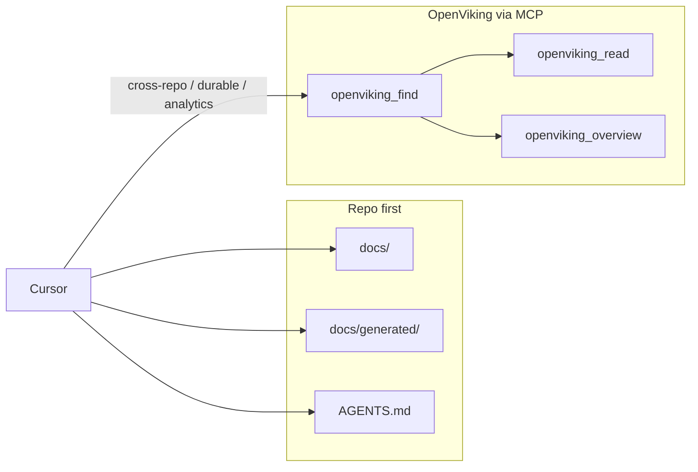

# OpenViking integration

OpenViking is used for **durable repository knowledge** and documentation index, exposed via MCP. It is not an app runtime dependency; the application does not depend on OpenViking at runtime.

## Role

- **Resources-first:** OpenViking stores and serves indexed docs, module maps, and other durable artifacts. Cursor queries it through a thin MCP layer when cross-repo or durable search is helpful.
- **Do not replace Cursor's native repo understanding.** Use OpenViking to augment (e.g. full-text or semantic search over many docs), not to substitute for reading the repo and AGENTS.md.

## Canonical URI and structure

- Use a consistent URI structure for resources (e.g. by repo, then path or type). Document the convention in the OpenViking MCP adapter or team docs so future repos plug in the same way.
- Authored docs in the repo remain the authority; OpenViking is an index. Generated docs (e.g. from `scripts/generate_docs_index.py`) can be ingested for search.

## What to ingest

- Authored docs (docs/, READMEs, key .md in repo). Generated maps (dependency, module, routes) if available. Avoid binaries and heavy artifacts.

## What stays repo-only

- Secrets, env files, and credentials never go to OpenViking. Runtime config and private keys stay in repo or secure storage only.

## Cursor usage

- Prefer reading from repo (docs/, AGENTS.md, generated/) first. Use OpenViking when the task benefits from durable or cross-repo search. See .cursor/rules/60-openviking-knowledge-usage.mdc. When using OpenViking, apply the `use-openviking` skill (`.cursor/skills/use-openviking/`).

---

## Install and configuration

Documentation only; no secrets in repo. Each developer or CI that runs OpenViking configures their own environment.

### Install

- **Python package:** `pip install openviking` (Python 3.10+). Optional: `openviking-server` for HTTP mode; Rust `ov` CLI for manual ingest (see [OpenViking Quick Start](https://github.com/volcengine/OpenViking#quick-start)).
- **Config file:** Create `~/.openviking/ov.conf` (or set `OPENVIKING_CONFIG_FILE` to another path). Required sections:
  - **storage.workspace** — directory for OpenViking data.
  - **embedding.dense** — provider and model configuration.
  - **vlm** — provider and model configuration.
  - Provider blocks in this repo use `provider: "openai"` against custom OpenAI-compatible endpoints (`api_base`):
    - Embeddings: OpenRouter
    - VLM/chat/summary: MiniMax Coding Plan
- **Environment:** Set `OPENVIKING_CONFIG_FILE` (e.g. `~/.openviking/ov.conf`). Do not commit `ov.conf` or put API keys in the repo.

### Using OpenRouter for embeddings

Copy [ov.conf.example](../archive/engineering-system-global-cursor-pack/mcp/ov.conf.example) and set your OpenRouter settings:

```json
{
  "provider": "openai",
  "api_base": "https://openrouter.ai/api/v1",
  "api_key": "YOUR_OPENROUTER_API_KEY",
  "model": "openai/text-embedding-3-small",
  "dimension": 1536
}
```

Get your API key from OpenRouter and choose an OpenRouter embeddings model. Use only keys intended for indexing; avoid secrets in repo.

### Using MiniMax Coding Plan for VLM

Set VLM/Coding-plan chat to MiniMax using their OpenAI-compatible API endpoint:

```json
{
  "provider": "openai",
  "api_base": "https://api.minimax.io/v1",
  "api_key": "YOUR_MINIMAX_CODING_PLAN_API_KEY",
  "model": "MiniMax-M2.5"
}
```

Subscribe to [MiniMax Coding Plan](https://platform.minimax.io/docs/coding-plan/quickstart), create a Coding Plan API key, then set `api_key` in `vlm` to that key. **Copy the key exactly** (e.g. from `.env`); a single character typo will cause 401. See the [OpenAI-compatible API docs](https://platform.minimax.io/docs/api-reference/text-openai-api) for request compatibility and supported models (e.g. `MiniMax-M2.5`, `MiniMax-M2.5-highspeed`).

For full configuration examples and alternatives, see the [OpenViking quick start](https://github.com/volcengine/OpenViking#3-environment-configuration).

### Server

- **MCP over HTTP:** Run `openviking-server` (default port 1933). Point Cursor MCP at that URL. One server per workspace/data dir to avoid contention.
- **MCP over stdio:** Use the upstream OpenViking MCP server setup from official docs. Cursor MCP can be configured with `OPENVIKING_CONFIG_FILE` and `OPENVIKING_DATA_PATH`; ensure your `ov.conf` exists (copy from `docs/archive/engineering-system-global-cursor-pack/mcp/ov.conf.example` and add API keys). Create the workspace dir, e.g. `mkdir -p ~/.openviking/workspace`.

---

## Ingest playbook

**What to ingest:** Authored docs (`docs/`, key READMEs, important `.md` in repo), generated maps (`docs/generated/` after running `scripts/generate_docs_index.py`). Avoid binaries, heavy artifacts, secrets, and env files.

**Command pattern:** With the `ov` CLI connected to a running OpenViking server: `ov add-resource <path-or-URL>` (e.g. `ov add-resource docs/` or repo root). Use `--wait` if you need processing to complete before exiting. Add resources by consistent naming (e.g. by repo or project) so URIs stay predictable (e.g. `viking://resources/g-trade/...`).

**Exclusions:** Do not ingest secrets, `.env`, credentials, or runtime config with secrets. The app does not depend on OpenViking at runtime.

### First-time ingest (onboarding)

1. **Prereqs:** Create `~/.openviking/ov.conf` (copy from [ov.conf.example](../archive/engineering-system-global-cursor-pack/mcp/ov.conf.example), add your API keys). Create workspace dir: `mkdir -p ~/.openviking/workspace`. Set `OPENVIKING_CONFIG_FILE` and optionally `OPENVIKING_DATA_PATH` if you use a different path.
2. **Run from G-Trade repo root** (workspace root where docs/ and scripts/ live): `python scripts/onboard_openviking.py`  
   The script runs `generate_docs_index.py`, then ingests `docs/` (authored + generated) and `AGENTS.md`, `README.md`. It prints the `viking://` root URIs for querying.
3. **Refresh:** Run the same command after significant doc or structure changes, or after a merge. See "Refresh cadence" below.

---

## Refresh cadence

- Run ingest after significant doc or code structure changes, and after running `scripts/generate_docs_index.py` or after a merge. Optional: schedule a refresh (e.g. post-merge in CI or manually). Do not assume real-time sync; treat OpenViking as an index refreshed on a cadence.

## Context flow (summary)


